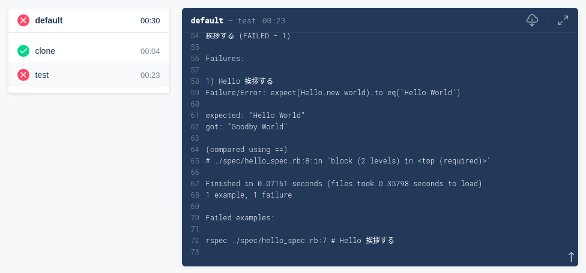
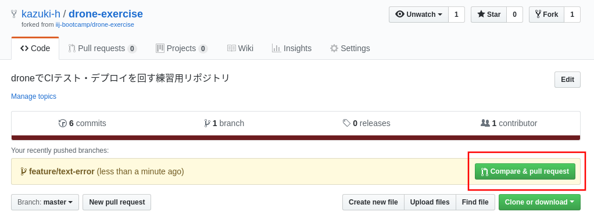
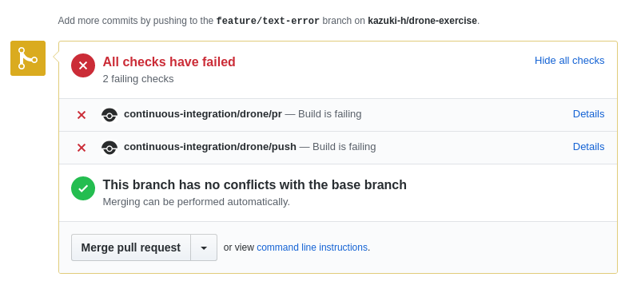
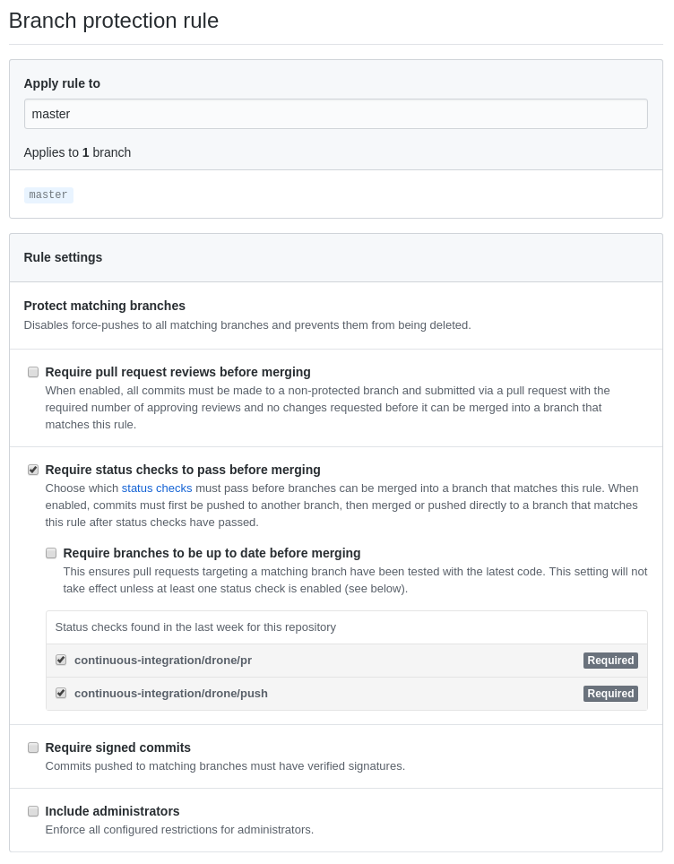
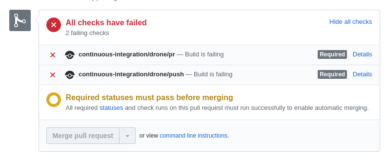

# drone でCIテスト・デプロイを回す

## 0. この講義について

### 0.1 この講義の目的

継続的インテグレーション(Continuous Integration)、継続的デリバリ(Continuous Delivery)について理解する。
drone を利用したCI/CDを体験し、自分のプロジェクトにCI/CDを自ら導入できるようにする。

### 0.2 ハンズオンの対象者

これからプログラムを書く、またはテキストファイルによる設定ファイル、マニュアル、仕様書などを記述する可能性のある技術者を対象としています。

講義にあたって事前に以下の要件を満たすようにしてください。

- YAMLの読み書きができること
  - 知らない場合は[Learn YAML in five minutes!](https://www.codeproject.com/Articles/1214409/Learn-YAML-in-five-minutes)をご覧ください。
- 「Gitの使い方＋GitHubを使った開発手法」を受講しておくこと
  - この講義の中では git の操作に加え GitHub 上での操作も必要になります。アカウントがない場合は事前に用意してください。

::: tip チェックポイント1 🏁
Gitの使い方＋GitHubを使った開発手法を受講しましたか？
git clone, checkout, add, commit, push などを利用します。
:::

### 0.3 事前準備

- gitを利用できる環境を準備してください。
- お好みのテキストエディタを準備してください。
  - この講義では[VSCode](https://azure.microsoft.com/ja-jp/products/visual-studio-code/)を推奨します。
[Atom](https://atom.io/)や[Sublime Text](https://www.sublimetext.com/3)、[Nodepad++](https://notepad-plus-plus.org/)を使ってもかまいません。Vimに慣れている人はVimを使ってもよいです。
メモ帳、サクラエディタ、TeraPadは非推奨です。

### 0.4. この資料のお約束

:computer: は自分で操作する箇所を示しています。

 <ほげほげ> で囲まれている部分は自分の設定値で置き換えてください。たとえば

```
git clone <リモートリポジトリのアドレス>
```

と記載されている箇所は

```
git clone git@github.com:iij/bootcamp.git
```

というように置き換えてください。

## 1. 継続的インテグレーション、継続的デリバリとは

継続的インテグレーション(Continuous Integration、以下CI)とは、
アプリケーションのリリースサイクルにおいてビルドやテストなどを自動化し、
継続的に実行することで品質改善や納期短縮を実現するための方法です。

もしかしたら自分のプロジェクトがそうかもれませんが、プログラミングは意外と手作業の多い分野でした。
しかしながら手作業でビルド、テストをしていると不具合が含まれていても発覚するのが遅くなり、手戻りが大きくなってしまいます。
そこでビルドやテストを自動化し、コードがpushされたらすぐに実行することで早期に不具合を見つけようというのがCIです。
また世の中にはビルドが難しいプロダクトというのも多数存在しますので、自動化されているということは開発メンバーを追加するのも楽になります。

継続的デリバリ(Continuous Delivery、以下CD)とはCIをさらに進めてユーザに製品を届けるまでのリリースプロセス全体を自動化し、
**継続的に顧客に価値を届ける**ことを目的とした手法です。

CI/CDを導入した場合、コードをコミットするとビルドが走り、ユニットテストを通して、コードがテスト環境にデプロイされます。その後結合テスト、
システムテストを行い、必要であれば承認後、本番環境にデプロイされます。

## 2. droneとは

[drone](https://drone.io/) とはdockerをベースとしたCI/CDのためのプラットフォームです。
IIJ社内ではdrone v1.0を提供しています。

::: tip
社内のプライベートな環境で使えるdroneが用意されていることがあります。
講師の指示がある場合はそちらの環境を利用しましょう。
:::

- サイト: https://cloud.drone.io/
- ドキュメント: https://docs.drone.io/

GitHubと連携して簡単に設定を行うことができ、設定もyamlに記載するシンプルなもので、dockerベースのため環境構築も簡単に行うことができます。

### 2.1. とりあえず初めてみる

#### 2.1.1. droneの設定を有効化する

このハンズオンのためにCI/CDを行うためのサンプルリポジトリを https://github.com/iij/drone-exercise に用意しています。

:computer: GitHub上で操作し、作業用レポジトリを作成してください。


上記リポジトリを開いて「Use this template」を押してください。リポジトリ名は「```drone-exercise-<user名>```」にしましょう。 他の設定値はデフォルトで良いです。
ここで作成したレポジトリに対して操作をしていきます。

::: warning
もし、Use this template が表示されていない場合は githubにログインできていないかもしれません。ログインしてからやり直してください。
また、講師から repository を作成する organization や repository 名が指示されている可能性があります。
:::

droneはGitHub上のコミットやpushといったイベントが発生するとそれに応じて自動的に処理が走るようになっています。
これはWebhookという仕組みを用いて実現されていますが、droneを使う前にこの設定が必要です。

:computer: droneにリポジトリを登録する。

::: warning
https://cloud.drone.io/ では 新規のユーザー登録を行っていません。
そのため、以下の手順を実施するためには drone.io の 構築が必要です。
講師は接続先を案内してください。
:::

講師に案内されたdrone.io にログインしてください。 continue から github.com のアカウントを利用して
Repositories の リストから「自分のアカウント名/```drone-exercise-<user名>```」を探してレポジトリ名をクリックし詳細ページを開きましょう。
見つからない場合は「SYNC」ボタンを押してから探してください。
「SETTINGS」タブから「ACTIVATE REPOSITORY」をクリックすると自動で設定が行われ、設定画面が表示されます。

これでdroneを利用する準備が整いました。

#### 2.1.2. droneでテストを実行する

:computer: 作成した作業用リポジトリ(自分のアカウント名/```drone-exercise-<user名>```)をローカルにgit cloneしてください。

このリポジトリにはすでにdroneの設定ファイルが置かれています。
適当に`README.md`を編集してコミット、pushしてみましょう。

::: tip
おさらいです。 編集したあとは git add でステージング したのち commit && push となります。

date >> README.md
git add README.md
git commit -m "update README.md"
git push origin master
:::

github に push してしばらくすると drone で テストが実行されます。

先程開いた droneの「自分のアカウント名/```drone-exercise-<user名>```」の 詳細ページから「ACTIVITY FEED」タブを開くとテストの実行ログが表示されます。
クリックして 実行ログを読むとどのようにテストが実行されているかが分かります。

このリポジトリにはRubyで書かれたプログラムと、Ruby用のテストフレームワークである[RSpec](https://rspec.info/)で
書かれたテストが置かれています。


図を見ると、 clone と test の step からなるとわかります。
それぞれクリックすると各 step の詳細が表示されます。

::: tip チェックポイント2 🏁
「test」ではどういうメッセージが出力されたでしょうか？
:::

#### 2.1.3 WebHookの設定確認

drone と GitHub の連携には WebHook を利用しています。

デフォルトでは`pr`と`push`の2つが登録されています。

`pr`を指定すると、Pull Requestをオープンしたとき、または既存のPRへpushしたときにテストが実行されます。
`push` を指定すると、`git push` したときにテストが実行されます。

この設定は 「Settings」->「Hooks」->「Webhooks」-> droneのエントリ -> Edit で確認でき、

設定画面最下部の「Recent Deliveries」では実際に発行されたWebHookを確認 & 再送信することが可能です。

## 3. droneの基本的な設定

drone設定の基本は、どういった環境で、どのようなコマンドを実行するかということを記述することです。
設定はKubernetesライクな書き方になっていますので、Kubernetesの知識があれば読みやすいです。

droneはバージョンによって設定ファイルの書き方が異なりますので、
既存のプロジェクトを編集する時は気をつけてください。

droneの設定はデフォルトでリポジトリの一番上の階層に`.drone.yml`という名前で置きます。
2.1.2 でcloneしたリポジトリの`.drone.yml`を見てみましょう。

```yaml
kind: pipeline
name: default

steps:
  - name: test
    image: ruby:2.6.2
    commands:
      - bundle install
      - rspec
```

各項目について解説していきます。

### 3.1. Pipeline

```yaml
kind: pipeline
name: default
```

一連のテスト実行の流れを`Pipeline`と呼びます。
まずyamlの先頭で`kind: pipeline`と記載し、この下に書かれる設定値がPipelineのものであることを宣言します。
ただIIJの環境では`Pipeline`以外の設定は利用できませんのでこの`kind`と`name`は固定になります。

`Pipeline`は複数の`Step`で構成されます。

### 3.2. Steps

ひとつのPipelineで複数のテスト(`Step`)を実行できます。
各`Step`は別々のdockerコンテナで実行され、各テストは独立した環境でテストできます。
UI上では各`Step`ごとに結果が分けて表示され、`name`で名前を付けることができ、これはUI上に表示されます。


`image` はテストに利用するdockerイメージを指定します。

`image: ruby` と指定した場合はDocker Hubの[Ruby Official Image](https://hub.docker.com/_/ruby)が利用されます。
素性のわからないイメージを利用することはやめましょう。

また、`image: ruby:3.1.2` のようにタグを指定して、特定のバージョンを利用できるイメージもありますが意図せず更新される場合があります。

::: tip
プライベートなDockerイメージ置き場を自分で作成することもできます。
:::

`commands` にはコンテナ内で実行するコマンドを記述します。
`bundle install` ではテスト実行に必要なライブラリをインストールしていて、`rspec`でテストを実行しています。

各テストが成功したかどうかは各コマンドのExit Codeを見ていて、Code 0以外ではテストは中断され失敗となります。
テストが失敗すると以下のような表示になります。



## 4. Pull Requestと組み合わせる

droneを設定した状態でPull Requestを作成するとどうなるでしょうか。

:computer: 意図的にテストが失敗するようにコードを修正し、Pull Requestを作成してみましょう。

1. まず、別の branch へ checkout します
```
git checkout -b feature/text-error
```

2. 実装である`hello_world.rb`を以下のように書き換えてみます。

```diff
  def world
-    'Hello World'
+    'Goodby World'
  end
```

3. 編集した内容を commit し push します。
```
git add hello_world.rb
git commit -m "goodby"
git push origin feature/text-error
```

:computer: GitHub を開いてPull Requestを作成しましょう。

別のbranch に push した内容を develop branch などへ取り込んでもらうためのリクエストを Pull Request(PR) と呼びます。



もし、このとき 作業レポジトリを fork して作成した場合 PR の送り先が fork 元 repository になっています。

その時は 自分のrepository に PR を送るように base repository (左側) の 表記を見直してください。

無事PRを作成できた場合 PRのページへ遷移します。

ページ下部にdroneのテスト結果が表示されています。
ひと目でテストが失敗していることがわかるでしょう。



::: tip チェックポイント3 🏁
Pull Request は作成できましたか？
drone.io は動作しましたか?
テストが失敗しましたか？
:::

### 4.1. テストが失敗したらマージできないようにしたい

さて、 先程のPRではテストに失敗してしまいました。

この状態でもMergeボタンを押すことは可能ですが、普通は押されたくないはずです。
この挙動はGitHubの設定画面から変更できます。

:computer: テストが通ったときだけマージできるように設定する

1. 「Settings」->「Branches」->「Branch protection rules」->「Add rule」を押し、
2. 「Branch name pattern」に「master」と記入し、
3. 「Include administrators」にチェックを入れます。
4. 「Require status checks to pass before merging」にチェックを入れて
5. 「Status checks found in the last week for this repository」に出ている
   「continuous-integration/drone/pr」と
   「continuous-integration/drone/push」にチェックを入れます。
6. 「Create」します。

:: tip もし、continuous-integration/drone/pr が見つからない場合
先ほど作成したPRによる drone のテストが上手く動いていないかもしれません。
fork した場合は PR の作成先を確認する必要があります。
PR の作成先が間違ってるかもしれません。見直してください。
::



先程作成したPull Requestのページに戻るとマージボタンが押せなくなっています。




これは複数人で開発するときには便利な機能です。

このあとmasterブランチを利用しますのでBranch protection rulesは削除しておきましょう。

:computer: Branch protection rules の一覧ページで`master`と名前がついたルールの`delete`ボタンを押す

:computer: この後項目のためにmasterブランチに戻っておきましょう。

```
$ git checkout master
```

::: tip チェックポイント4 🏁
マージボタンが押せなくなったのはなぜですか？
:::


## 5. さまざまなプラグイン

[droneには様々なプラグインが用意されています。](http://plugins.drone.io/)

主に外部と連携する機能が用意されています。
後述する利用の仕方からも分かる通り plugin は 単なる docker コンテナであるため、自分で開発することもできます。

```
Plugins are just Docker containers which means you can write plugins in any programming language that runs inside a container. You can even create plugins using simple bash scripting.
```
> https://docs.drone.io/plugins/overview/ より引用

### 5.1. キャッシュプラグイン

::: warning
この項目はS3互換のオブジェクトストレージが必要です。
講師は接続先を案内してください。
:::

これまでの例ではテストを実行するときに必要なライブラリを`bundle install`で事前にダウンロードしてから実行していました。
しかし毎回ダウンロードしていたのではテスト実行に時間がかかりますし、ネットワークの無駄です。

[s3-cache](http://plugins.drone.io/drone-plugins/drone-s3-cache/)プラグインを使うと特定のディレクトリを
[S3](https://aws.amazon.com/jp/s3/)に保存し、テストのたびに復元してくれる機能を提供します。

#### 5.1.1. ライブラリの保存場所を変更する

パッケージマネージャーによってはリポジトリの中ではなく、システムの特別な場所に配置するものがあります。
s3-cacheプラグインはリポジトリ内にあるファイルしかキャッシュできません。

nodejsのパッケージマネージャーであるnpmはデフォルトでリポジトリ直下にライブラリを配置しますが、
rubyのパッケージマネージャであるbundlerはシステム領域にライブラリを保存するため、
そのままではキャッシュさせることができません。
ほとんどの場合、パッケージマネージャーのオプションで保存場所を変更することができますので、
rubyを例に設定してみましょう。

rubyのパッケージマネージャであるbundlerは`--path`オプションで保存場所を指定できます。

`drone.yaml` で 実行している `bundle install` にオプションを渡し 一般的によく使われる`vendor/bundle`に保存するように変更してください。

:computer: パッケージの保存先を変更する

```
  - name: test
    image: ruby:2.6.2
    commands:
      - bundle install --path vendor/bundle
      - bundle exec rspec
```

#### 5.1.2. ライブラリをキャッシュさせてみる

さっそくキャッシュさせてみましょう。

このプラグインはキャッシュしたデータを戻す`restore`と、キャッシュを行う`rebuild`の機能があります。

`.drone.yml`を編集してキャッシュを組み込んでみましょう。
`rebuild`ステップで`vendor/bundle`ディレクトリをキャッシュし、
`restore`ステップでキャッシュされたものを戻します。

`test`Stepの前後に、`restore`と`rebuild`を追加します。

::: tip
以下の設定は各環境で用意された接続先へ値を変更してください。

<変数名>で書かれた場所を適切な値で置き換えてください。
:::

:computer: パッケージをキャッシュするように変更する

```yaml
steps:
  - name: restore
    image: plugins/s3-cache
    settings:
      pull: true
      endpoint: <ENDPOINT>
      access_key: <ACCESS_KEY>
      secret_key: <SECRET_KEY>
      restore: true

  - name: test
    image: ruby:2.6.2
    commands:
      - bundle install --path vendor/bundle
      - bundle exec rspec

  - name: rebuild
    image: plugins/s3-cache
    settings:
      pull: true
      endpoint: <ENDPOINT>
      access_key: <ACCESS_KEY>
      secret_key: <SECRET_KEY>
      rebuild: true
      mount:
        - vendor/bundle
```

:computer: コミットして実行してみましょう。

```
git add .drone.yml
git commit -m "Cache導入"
git push origin master
```

droneのUI上で最新の実行ログを開いて見ましょう。
`restore`と`rebuild`のステップが増えていることを確認してください。

1回目はキャッシュされてないので何も起きませんが、2回目からはキャッシュが使われるので実行が早くなります。
1回目の実行時間を確認してから、以下のように2回目のテストを実行してみてください。

`--allow-empty` はファイルを変更していなくてもコミットを作ることができるオプションです。

```
git commit --allow-empty -m "Cacheの効果を確認する"
git push origin master
```

::: warning drone で完結しない処理です。 もしオブジェクトストレージ側にトラブルがあれば drone 上の処理が長時間に及ぶ可能性があります。 drone 上の ジョブの同時実行数には限りがある場合があります。 処理が終わらず長時間に渡る場合は drone 上のジョブの実行結果が確認できる画面から キャンセルができます :::

:computer: テスト実行が早くなっていることを確認しましょう。

::: tip チェックポイント5 🏁
テストが速くなったのはなぜですか？
:::

## 6. さまざまな応用

### 6.1. Text Lintを使った日本語チェックの例

droneはプログラムにしか使えないものでしょうか。そうではありません。
droneは何でも動かすことができますから、テストをすることだけが仕事ではありません。

ここでは自然言語のチェックを行う [textlint](https://textlint.github.io/) を使った例を紹介します。

:computer: stepsに以下の項目を追加してみましょう。

```yaml
  - name: textlint
    image: node
    commands:
      - npm install textlint
      - npm install textlint-rule-preset-ja-technical-writing
      - $(npm bin)/textlint --format pretty-error --preset ja-technical-writing README.md
```


textlintはnodejsで動作しますので、イメージにnodeを指定します。
textlintはフレームワークのみでこれ単体で動かすことはできません。どういったものをチェックするかというルールは別に定義しなければいけません。
ここでは日本語の技術文書を書く上で必要ないくつかのルールをまとめた
[textlint-rule-preset-ja-technical-writing](https://github.com/textlint-ja/textlint-rule-preset-ja-technical-writing)
を利用します。試しに `README.md`をチェックしてみましょう。

:computer: README.mdをTextlintでチェックする。

```
git add .drone.yml
git commit -m "textlintによるチェック"
git push origin master
```


このようにチェックする対象はプログラムに限りませんので、マニュアルなどのドキュメントのチェックなどにも活用できます。

::: tip チェックポイント6 🏁
droneが利用できる事例としてふさわしいものはどれですか？
:::

### 6.2 Services

単純なスクリプトやライブラリのテストはこれだけでも十分にdroneでテストできます。

ではデータベース使ったテストはできるでしょうか。
データベースのテストをするならデータベースのプロセスが上がっている必要があります。
でも1つのコンテナでアプリケーションと一緒にデータベースも一緒に立ち上げたくないですよね。

そのために`Service`という仕組みがあります。
同時に複数のコンテナを立ち上げて待機させておき、テスト中利用できます。

サンプルとしてRuby on Rails＋MySQLで構成されたアプリケーションを用意しました。

:computer: https://github.com/iij/drone-exercise-rails から 作業用レポジトリを作成し、git cloneしてください。


上記リポジトリを開いて「Use this template」を押してください。

リポジトリ名は「```drone-exercise-rails-<user名>```」にしましょう。 他の設定値はデフォルトで良いです。
ここで作成したレポジトリに対して操作をしていきます。

Ruby on RailsはWebアプリケーションを作るためのRuby製フレームワークです。
データの保存にMySQLなどのデータベースを利用できます。

標準的なWebアプリケーションではデータベースなどの外部サービスにデータを保存し、それを読み取って加工して表示するという動作が多く、
テストするときもデータベースが動いている必要があります。

上記リポジトリにはテストを行うだけの `.drone.yml` が含まれています。

```yaml
kind: pipeline
name: default

steps:
  - name: test
    image: ruby:2.6.2
    environment:
      RAILS_ENV: test
    commands:
      - bundle # 実行に必要なライブラリをインストールする
      - bundle exec rails db:reset # テスト用のデータベース、テーブルを作成する
      - bundle exec rails test # テストを実行する
```

:computer: まずはこの状態でテストを実行し、結果を見てみましょう。
新しいrepository への drone の 有効の仕方 内容の変更を伴わないcommit をする方法を思い出してください。

ちなみにテストは `test/models/user_test.rb` に書いてあります。

この状態ではデータベースが動いていないのでテストが成功しません。
テストしている間横でなにか動かしておきたいという場合には `Service` を使います。
今回はMySQLを使いますが、[MySQLは公式でdockerイメージが提供されています](https://hub.docker.com/_/mysql)のでこれを利用します。

:computer: 以下の項目を`.drone.yml`に追加してください。

kind, name, steps と同じ高さでよいです(services の左側にスペースははいりません)

```yaml
services:
  - name: db
    image: mysql:8.0.16
    command: [ "--default-authentication-plugin=mysql_native_password" ] # MySQL8.0のデフォルト認証方式にRailsが対応していないため変更
    environment:
      MYSQL_ALLOW_EMPTY_PASSWORD: 'yes' # テスト用にパスワードなしで接続できるようにする
```

`name` で名前をつけて `image` で使用するdockerイメージを指定します。

Railsではデータベースの設定を`config/database.yml`から読み込みます。
droneで設定したデータベースへ接続するための設定値を見てみましょう。

```yaml
test:
  <<: *default
  host: db
  port: 3306
  socket: null
  database: drone-exercise-rails_test
```

このファイルで接続先MySQLサーバーのホストを指定しているのですが、
ここでは`.drone.yml`で指定した`db`がホスト名になっていて、この名前で接続できるようになります。

::: tip チェックポイント7 🏁
テスト実行中にデータベースはどこにいるでしょうか？
:::

## 8. 参考情報

- [drone Documentation](https://docs.drone.io/)

## 続き

- [GitHub Actions でCIテスト・デプロイを回す](../github_actions/README.md)
