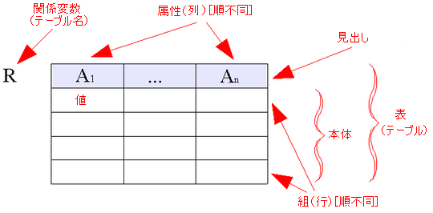

<header-table/>

# Database Overview

Databaseとはいかなる道具かを知るきっかけを与える場として本企画に賛同してこの資料をまとめます。
アプリケーション開発者を目指す方にはデータとの向き合い方を考える一材料として、あるいはDatabaseを
専門的に取り組む事を目指す方にはこれを機に幅広い知識を自ら深める入り口を与えられる事を期待します

## 目次

1. データ、データベースの関係
2. RDBMS(Relational Database Management System)
3. Relational Model
4. SQL(Query)
5. ACID特性
6. データの保全
7. データベースの中で起きている事を知る
8. RDBMSが突きつけられた課題
9. RDBMSに代る選択肢 (kvs, Document DB, others)
10. Database as a Service
11. 最適解は何か

## データ、データベースの関係

1. データとは
　「ISO/IEC 2382-1」および日本工業規格の「X0001 情報処理用語-基本用語」において「データ」の用語定義は 
  "A reinterpretable representation of information in a formalized manner suitable for communication, interpretation, or processing."
  「情報の表現であって、伝達、解釈または処理に適するように形式化され、再度情報として解釈できるもの」とされている
   
   出典:WIKIPEDIA
   
3. データベースとは
　　データベースとは、構造化した情報またはデータの組織的な集合であり、通常はコンピューター・システムに電子的に格納されています。データベースは通常、データベース管理システム
  （DBMS）で制御します。データとDBMS、およびそれらに関連するアプリケーションをまとめてデータベース・システムと呼びます。多くの場合は単にデータベースと呼んでいます。

   出典: https://www.oracle.com/jp/database/what-is-database/
   
   *受講者の方に質問
 　  Q.「データベースといって思い浮かべるものは、何ですか？」
   　A.「　　　　」「」
    
## RDBMS(Relational Database Management System)

1. RDBMS(Relational Database Management System)
   
   関係（かんけい、リレーション、英: Relation）とは関係モデル（リレーショナルモデル）において、一つの見出しと0以上の同じ型の組(タブル、行)の
   順序づけられていない集合からなるデータ構造のことである
   
   出典:WIKIPEDIA
   
   RDBMSにおいてはデータを行と列から構成される2次元の表形式で表す事が多く、ここからはTABLE(表)を使ったデータモデルを例に
   理解を進める
  
##  Relational Model

1. もう少し身近なデータを使って「関係」を表現してみます
   - 2021年度新入社員の関係性に関するデータモデル
　　　
     ```
     // emp
     EMPNO DEPNO ENAME     JOB      MGR  HIREDATE   SAL
     1     10    suzuki    CEO      null 1992-12-03 XXXXXXXXXXX
     2     20    tanaka    HR-MGR   1001 1993-01-21 XXXXXXXXXXX        
     3     40    sato      ENGINEER 2001 1995-10-30 XXXXXXXXXXX
     4     51    sasaki    SALES    2010 1997-04-01 XXXXXXXXXXX
     5     50    sasaki    SALES    2020 1999-06-01 ZZZZZZZZZZZ
     6     51    takahashi GENERAL  1002 1999-06-01 ZZZZZZZZZZZ
     7     20    nishi     GENERAL  1002 1999-04-01 ZZZZZZZZZZZ
     8     32    fujimoto  ENGINEER 2050 2000-04-01 XXXXXXXXXXX
     9     40    fujita    ENGINEER 2001 1998-01-01 XXXXXXXXXXX
     // dept１
     DEPNO DNAME       LOCATION    DESC
     10    CEOROOM     IDB         XXXXXXXXXXX
     20    HR          IDB         XXXXXXXXXXX        
     30    SUPPORT     SRI         XXXXXXXXXXX
     31    OPERATIONS  IDB         XXXXXXXXXXX 
     32    OPERATIONS  FKO         XXXXXXXXXXX
     33    OPERATIONS  OSK         XXXXXXXXXXX
     40    DEVELOPMENT IDB         XXXXXXXXXX
     50    SALES1E     IDB         XXXXXXXXXXX
     51    SALES2E     IDB         XXXXXXXXXXX
     52    SALES3E     IDB         XXXXXXXXXXX
     53    SALES1W     OSK         XXXXXXXXXXX
     ```
##  SQL 

1. SQL(Strutured Query Languageの略)
   - データ定義:データを格納する表を定義
   - データ操作:表に対してデータの検索、更新、挿入、削除、複数の表を結合
   - トランザクション機能:データを更新してから、更新情報が確定するまでの一連の流れを管理
   
   この中から最も重要な機能となる「データ検索/Query(クエリ)」について触れます
   前述のEMP表、DEPT表を用いて次の条件で”データ検索”を行ってみましょう
   
    Q.ENGINEER職かつ、DEVELOPMENT部に属している社員名を調べよ
    A.< >

<credit-footer/>
