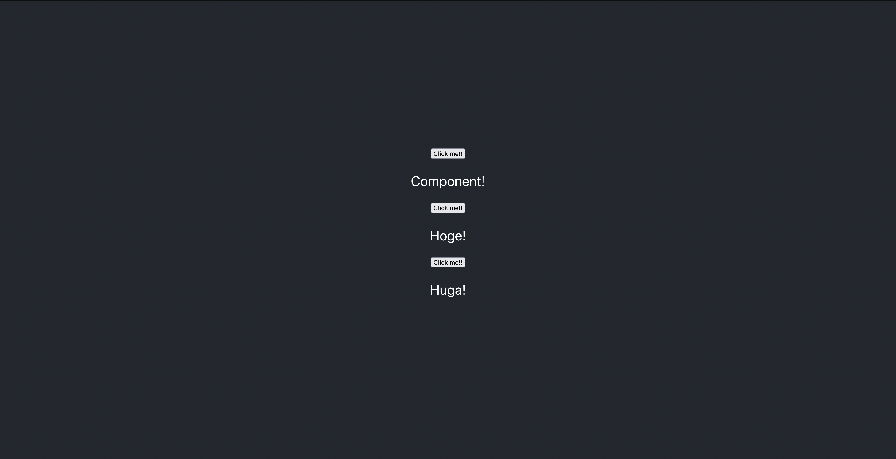

<header-table/>

# {{$page.frontmatter.title}}

## 下準備
講義を受講する前にコンテナイメージのpullと起動をしておくことをお勧めしています。
また、Dockerの実行環境があることを前提として本講義を進めます。

### 手順

1. ハンズオン用のDockerイメージをpullしてくる

```bash
# やや重たいので注意してください
$ docker pull astk03/bootcamp-react:2022
```

2. コンテナを起動する

```bash
# コンテナを起動する
$ docker run --name bootcamp-react -itd -p 3000:3000 astk03/bootcamp-react:2022
```

3. アプリケーションの起動チェック

```bash
# コンテナの中にアタッチする
$ docker exec -it bootcamp-react bash
# Reactの開発用サーバーを起動する
❯ npm start
# ...
# いろんなログが流れる
```

4. 動作チェック

ホストマシンから適当なブラウザ(※IEを除く)から[localhost:3000](http://localhost:3000)にアクセスし、Welcomeページが表示されることを確認してください。


:::tip 

動作しなかった場合は2021年度版のイメージ ryusa/bootcamp-react:2021 を使ってみてください。

:::

## 始めに

本講義ではReactの動作原理を学びながら簡単なシングルページアプリケーションの作成を通して、今後の技術的な選択肢を増やすことを目的としています。

### 達成目標

- フロントエンド開発を経験する
- コンポーネントベース開発を経験する
- React開発の流れを理解する

### 本講義の前提

本講義ではプログラム言語共通の制御構文や概念、たとえばif文や型など、の解説は行いません。
そのため、受講者は何らかのプログラミング言語で簡単な制御構文が書けることを前提とさせてください。

### この資料のお約束
:computer: は自分で操作する箇所を示しています。 また`$`はホストマシンのプロンプトを意味し、`❯`はコンテナ内部でのプロンプトを意味します。

たとえば下記の通りです。

```shell
# ホストマシン上で git clone git@github.com:iij/bootcamp.git を実行する
$ git clone git@github.com:iij/bootcamp.git

# コンテナ上で curl localhost:3000 を実行する
❯ curl localhost:3000
```

## Reactとは

Reactは、もともとFacebook社が開発しているWebユーザーインタフェースのためのフレームワークです。
2021年6月現在のGoogleトレンドをみる限りフロントエンドフレームワークとしてのシェアは世界一位となっており、多くの場所で利用されていることが見て取れます。
IIJでもいくつかの製品のフロントエンドとしてReactが採用されています。

公式サイト：[React - ユーザインターフェース構築のためのJavaScriptライブラリ](https://ja.reactjs.org/)

ReactはVueやAngularと同じくコンポーネントベースでWebUIを実装していくフレームワークです。
細かくコンポーネントを分離することでアトミックデザインなUIを実装しやすくなります。
また型を持つTypeScriptと組み合わせて使うためのツール整備も進んでいるため、開発者からの評価も高いです。

:::tip Create React App

Reactを始めるための方法としては、いくつかの方法があります。

- Reactの基礎を体験したい = オンラインサービスを使う
  - [CodePen](https://reactjs.org/redirect-to-codepen/hello-world)
  - [CodeSandbox](https://codesandbox.io/s/new)
  - [Glitch](https://glitch.com/edit/#!/remix/starter-react-template)
- 既存のHTMLページの中にReact埋め込みたい = 下記のチュートリアル
  - [Add React to a WebSite](https://reactjs.org/docs/add-react-to-a-website.html)
- フルにReactを使ってアプリケーションを作りたい = 下記のscaffolding(プロジェクトのひな形作成)ツール
  - [Create React App](https://facebook.github.io/create-react-app/docs/getting-started)
    - Reactが公式で出している
  - [Vite](https://vitejs.dev/guide/#scaffolding-your-first-vite-project)
    - 2022年現在勢いのあるツールで、create-react-appと比べて動作の軽量化のための工夫がされています
    - React以外にもVueやAngularなどのフレームワークにも対応しています

このハンズオンでは、Create React Appを使ってプロジェクトのひな型を作成しています。
詳細は[Dockerfile](https://github.com/iij/bootcamp/blob/master/src/frontend/react/Dockerfile)を参考にしてください。

:::

### シングルページアプリケーションとは
シングルページアプリケーション(以下SPA)とはフロントエンドアプリケーションの構成のひとつです。

[シングルページアプリケーション | Wikipedia](https://ja.wikipedia.org/wiki/シングルページアプリケーション)

特徴として
- HTMLとCSS、そしてJavaScriptのファイルのみで構成
  - HTMLは単一
  - サーバーとの通信は原則API経由
- DOMの操作や変更はJavaScriptで実施
  - 物理DOMの操作と比べて軽量
  - 滑らかな画面遷移によるユーザー体験

といったものが挙げられます。`create-react-app`で構成したReactプロジェクトはデフォルトでSPAがビルドできるようになっています。
Reactプロジェクトをビルドすることで最終成果物である「HTML」「CSS」「JavaScript」が生成され、それらをNGINXなどのWebサーバーで配信することができます。

なおすべてのWebアプリケーションがSPAであるわけではなく、SPAでないものとして、ブラウザのページ遷移を伴うマルチページなアプリケーションや、SSR(=サーバサイドレンダリング)が挙げられます。
SSRはサーバー側でユーザーのリクエストに合わせてDOMを動的に構築し、HTMLとしてユーザーに配信する構成です。
Angular Universalなどではこの方式でアプリケーションを配信します。

## Reactハンズオン
実際にReactに触れてみましょう。本講義ではTypeScriptを使ってReactを書いていきます。

### Hello World

Reactの開発サーバは、ソースコードの変更を検知してその変更をブラウザに伝えてくれます。
さっそくひとつやってみましょう。

これから先、ファイルを編集することになるので別のシェルを取得して進めてください。

```bash
# 別のターミナルでシェルを取得しておく
$ docker exec -it bootcamp-react bash
❯ 
```

:computer: src/App.tsxを開き下記の通りに編集してください。

```tsx{7}
import './App.css';

function App() {
  return (
    <div className="App">
      <header className="App-header">
        <p>Hello World!!</p>
      </header>
    </div>
  );
}

export default App;
```

編集して保存するとブラウザが自動的にリロードされ、下記のような画面に変わります。


:::warning 自動的にリロードされない場合
リロードがうまくいかない場合、開発用サーバーでエラーが起きてしまっている可能性があります。その場合は開発用サーバーを一度止め、再起動してあげてください。

```bash
❯ npm start
```
:::

#### チェックポイント
- ReactでHello Worldを実施した

### コンポーネントを作成してみる

ReactはUIの部品をコンポーネントという単位に分割することで、ロジックやスタイルなどの再利用性を高めて実装を行います。

:::tip コンポーネントを使わないとどうなるか

ReactではなくVueですが、こちらの記事が非常にわかりやすい例です。VueとReactともにコンポーネントベースのフレームワークですので、根幹は一緒です。
気になる人は読んでみてください。

[ワイ「何でそんな小っさいコンポーネント作ってるん？ｗ」 | Qiita](https://qiita.com/Yametaro/items/e8cb39b1a20b762bfafa)

:::

まず小さなコンポーネントを作ってみましょう。コンポーネントを記述する方法はいくつかありますが、まずクラスベースのコンポーネントを作成してみます。

:computer: src/Note.tsxを作成し、下記の通り編集してください。

```tsx
import React from "react";

// interface: TypeScriptにおけるインタフェース(抽象型)
interface NoteProps {}

interface NoteState {}

export default class Note extends React.Component<NoteProps, NoteState> {
  render() {
    return <p>Component! Component!! Component!!!</p>;
  }
}
```

:computer: さらにsrc/App.tsxがNote.tsxを使うように修正してください。

```tsx{2,8-9}
import './App.css';
import Note from './Note';

function App() {
  return (
    <div className="App">
      <header className="App-header">
        <Note />
        <Note />
      </header>
    </div>
  );
}

export default App;
```

さあ、[localhost:3000](http://localhost:3000)にアクセスするとブラウザに表示されている内容が変化したと思います。


このようにReactではコンポーネントというUI部品を組み合わせることでデザイン、UIを作成していきます。

#### チェックポイント

- クラスベースコンポーネントの書き方を学んだ
- コンポーネントの使い方を学んだ

### コンポーネントの機能 - 小要素へのデータの共有 : Props

`Note` コンポーネントを作成しましたが、今のままでは"Component! Component!! Component!!!"と叫ぶだけのコンポーネントで再利用性が悪いです。

他も文字を叫ぶことができるように、叫ぶ文字を外から渡してあげることができるようにしましょう。

:computer: src/Note.tsxを下記のように修正してみましょう。

```tsx{5-6,11-18,22}
import React from "react";

interface NoteState {}

// Noteコンポーネントを呼び出す側が指定するPropsを定義する
interface NoteProps {
  counter: number;
  word: string;
}

// 指定された回数だけ文字列を繰り返す
// repeatWord(3, "Component") -> "Component! Component!! Component!!!"
const repeatWord = (counter: number, word: string) => {
  const seq = [...Array(counter)].map((_, i) => i); // [0, 1, 2, ...]
  return seq.map((i) => word + "!".repeat(i + 1)).join(" ");
};

export default class Note extends React.Component<NoteProps, NoteState> {
  render() {
    // このコンポーネントが評価されたときのPropsの値は this.props として参照できる
    // this.propsを参照し、counterの数だけwordを叫ぶ
    return <p>{repeatWord(this.props.counter, this.props.word)}</p>;
  }
}
```

:::tip アロー関数(=>)

JavaScriptの関数には`function`キーワードによる定義の他に、ES2015から導入された`=>`を使うアロー関数があります。

表記が短く済むことに加えて、アロー関数には`this`をバインドしないという性質があります。
難しいと思うので初心者の方は「`this`にまつわる不具合が生じたら関数定義の種類を疑い、参考となるコードと見比べてみる」という意識を持つことから始めましょう。

`this`についての詳しい挙動に興味があれば[MDNの解説](https://developer.mozilla.org/ja/docs/Web/JavaScript/Reference/Operators/this)が参考になります。

:::

:computer: src/App.tsxを修正してください。

```tsx{8-10}
import './App.css';
import Note from './Note';

function App() {
  return (
    <div className="App">
      <header className="App-header">
        <Note counter={1} word={"Component"} />
        <Note counter={2} word={"Hoge"} />
        <Note counter={3} word={"Huga"} />
      </header>
    </div>
  );
}

export default App;
```

ここまで修正すると、下記の通りにブラウザの表示が変わります。


親コンポーネントからデータを注入できるように`props`を適切に定義することで、コンポーネントの再利用性をあげることができます。

注意が必要なこととして`props`はReadonlyなため、`props`の中身を書き換えたりすることはできません。
`props` の流れは常に親から子への一方通行、というReactの基本的な考えを意識するといいでしょう。

#### チェックポイント

- コンポーネントにおける`Props`について学んだ
- コンポーネントの親子間のパラメータの受け渡し方を学んだ

### コンポーネントの機能 - 内部データストア : State

`props`フィールドを通じてコンポーネント間のデータの受け渡しはできましたが、ユーザーからの入力や外部から取得した情報はどのように保存するべきでしょうか？
コンポーネントにはStateというデータの保存する機構が付属されています。試しに、ユーザーがボタンを押した数だけ叫ぶ回数を増やすように実装してみましょう。

:computer: src/Note.tsxを下記の通りに修正してください。

```tsx{4,8,18-40}
import React from "react";

interface NoteProps {
  word: string;
}

interface NoteState {
  counter: number;
}

const repeatWord = (counter: number, word: string) => {
  const seq = [...Array(counter)].map((_, i) => i);
  return seq.map((i) => word + "!".repeat(i + 1)).join(" ");
};

export default class Note extends React.Component<NoteProps, NoteState> {
  // Stateの初期化
  state = {
    counter: 1,
  };

  // クリック時のハンドラ
  onClickHandler = () => {
    // StateをsetStateメソッド経由で更新
    // setStateでStateを更新するとrenderの再評価が行われる
    this.setState({
      counter: this.state.counter + 1,
    });
  };

  render() {
    return (
      <>
        {/* ボタンをクリックされたらthis.onClickHandlerが発火し、Stateが更新される */}
        <button onClick={this.onClickHandler}>Click me!!</button>
        {/* Stateのカウンタの数だけ叫ぶ */}
        <p>{repeatWord(this.state.counter, this.props.word)}</p>
      </>
    );
  }
}
```

:computer: さらに下記の通りにsrc/App.tsxを修正してください。

```tsx{8-10}
import './App.css';
import Note from './Note';

function App() {
  return (
    <div className="App">
      <header className="App-header">
        <Note word={"Component"} />
        <Note word={"Hoge"} />
        <Note word={"Huga"} />
      </header>
    </div>
  );
}

export default App;
```

ここまで修正すると下記の通りになります。



Stateはコンポーネントの内部でのみ生きているデータベースのようなものです。
Stateを`setState`メソッド経由で更新を行うと、そのコンポーネントのレンダリング内容であるDOMが自動で更新されます。

実際に"Click me!!"のボタンをクリックしてみてください。

#### チェックポイント

- Stateを利用してコンポーネント内部で使えるローカルストアを作成できる
- `setState` メソッドでStateを更新するとコンポーネントが自動で更新される

### コンポーネントの機能 - ライフサイクルメソッド: LifeCycle

少しコンポーネントの複雑な機能について触れてみましょう。
今まではコンポーネントそのものに注力しましたが、ここではコンポーネントの作成の方法に注視してみましょう。

コンポーネントの中には[WebSocket](https://developer.mozilla.org/ja/docs/Web/API/WebSockets_API)や[HTTP SSE](https://developer.mozilla.org/ja/docs/Web/API/Server-sent_events/Using_server-sent_events)を利用した購読を行うものも多々あると思います。
多くのWebサイトで「画面の初期表示のタイミングで外部からデータを取得して画面に表示する」というケースを見かけます。
この機能はコンポーネントのライフサイクルを利用することで実現できます。実装してみましょう！

:computer: src/Note.tsxを下記のように修正します。

```tsx{9,17-23,29,32-45,55-56,61-64}
import React from "react";

interface NoteProps {
  word: string;
}

interface NoteState {
  counter: number;
  isLoaded: boolean; // コンポーネントのロードステータス
}

const repeatWord = (counter: number, word: string) => {
  const seq = [...Array(counter)].map((_, i) => i);
  return seq.map((i) => word + "!".repeat(i + 1)).join(" ");
};

// データローディングを想定した、ただ時間待ちするだけのタスク
// 2秒後にfullfill(解決)状態になるPromiseを返す
const simulateLoading = () => {
  return new Promise((resolve) => {
    setTimeout(resolve, 2000);
  });
};

export default class Note extends React.Component<NoteProps, NoteState> {
  // Stateの初期化
  state = {
    counter: 1,
    isLoaded: false,
  };

  // componentDidMountはReact.Componentに定義されており、
  // DOMツリーにコンポーネントが追加された直後に呼び出されるメソッド
  componentDidMount = () => {
    simulateLoading()
      // Promiseがfullfill(解決)状態になったとき
      // thenに渡された関数が実行される
      .then(() => {
        // このコンポーネントのStateを更新する
        // shallow-mergeされるので変更したいフィールドのみを指定できる
        this.setState({
          isLoaded: true,
        });
      });
  };

  onClickHandler = () => {
    this.setState({
      counter: this.state.counter + 1,
    });
  };

  render() {
    // 三項演算子(?:)でthis.state.isLoadedの値によりレンダリング内容を変える
    return this.state.isLoaded ? (
      // this.state.isLoaded: trueの場合に表示する内容
      <>
        <button onClick={this.onClickHandler}>Click me!!</button>
        <p>{repeatWord(this.state.counter, this.props.word)}</p>
      </>
    ) : (
      // this.state.isLoaded: falseの場合、"Loading..."が表示される
      <p>Loading...</p>
    );
  }
}
```

一瞬"Loading..."という文字列が見えてから2秒程度経過したのち、元の画面が表示されるようになったと思います。


初めて出てきた`componentDidMount`メソッドは`React.Component`で定義されているメソッドで、ブラウザ上にコンポーネントが描画された直後に走るメソッドです。

Reactのコンポーネントは`componentDidMount`のようにいくつかのライフサイクル用のメソッドが用意されています。
これらのライフサイクルメソッドを利用することでコンポーネントの初期化や後処理を定義できます。

[React lifecycle methods diagram](https://projects.wojtekmaj.pl/react-lifecycle-methods-diagram/)

それぞれのタイミングで実施したい処理があれば、それぞれのメソッドの中に実装してあげると良いでしょう。

詳しくはこちら > [state とライフサイクル | React Docs](https://ja.reactjs.org/docs/state-and-lifecycle.html)

#### チェックポイント
- コンポーネントにライフサイクルがあることを理解した
- ライフサイクルに合わせてフックを作成することができた

### 関数コンポーネント
ここまではReactのコンポーネントを表現する方法としてクラスベースなやり方を見てきました。
ここからはもう一つのコンポーネントの定義の方法である、関数コンポーネントと、React 16.8から導入されたHookについて紹介していきます。
私の経験上、業務で書くコンポーネントの9割以上は関数コンポーネントによるものです。

まずは関数コンポーネントの基本的な形について紹介しておきます。
クラスコンポーネントでは`React.Component`を継承したクラスの`render`メソッドを実装してレンダリング内容を定義しましたね。

例として一番初めにクラスコンポーネントとして実装した`Note`コンポーネントを書き換えてみましょう。

```tsx
export default class Note extends React.Component<NoteProps, NoteState> {
  render() {
    return <p>{repeatWord(this.props.counter, this.props.word)}</p>;
  }
}
```

これは関数コンポーネントでは以下のようになります。
ただの紹介なのでまだ手元のコードは書き換えないでくださいね。

```tsx
export default function Note(props: NoteProps) {
  return <p>{repeatWord(props.counter, props.word)}</p>;
}
```

関数コンポーネントは`props`を受け取りレンダリング内容を返す関数として定義されます。
シンプルですね。
ただしStateを受け取れるようにはなっていません。
関数コンポーネントでStateを扱うには次に紹介するHookを使う必要があります。

### Hooksを導入する

ReactにはReact Hooksという機能が存在しており、これは最初に紹介した関数型コンポーネントに簡単なライフサイクルの管理とステートの保持の機能を接続することができるものです。
詳細は[フックの導入](https://ja.reactjs.org/docs/hooks-intro.html)が参考になります。

それでは実際にReact Hooksの中の`useState`と`useEffect`を利用して、今までの実装を再実装してみましょう！

:computer: 新たにsrc/NewNote.tsxを作成し、下記の通り記述してください。

```tsx
import { useEffect, useState } from "react";

interface NoteProps {
  word: string;
}

const simulateLoading = () => {
  return new Promise((resolve) => {
    setTimeout(resolve, 2000);
  });
};

const repeatWord = (counter: number, word: string) => {
  const seq = [...Array(counter)].map((_, i) => i);
  return seq.map((i) => word + "!".repeat(i + 1)).join(" ");
};

// 関数型コンポーネントとして定義する
// 処理は普通の関数と同じように上から順に評価していく
export default function Note(props: NoteProps) {
  // useState(Stateフック)でコンポーネントで保持するStateを定義する
  // 第一返値にStateそのもの、第二返値にStateの更新トリガーが入ります
  const [counter, setCounter] = useState<number>(1);
  const [isLoaded, setIsLoaded] = useState<boolean>(false);

  // useEffect(副作用フック)でライフサイクルメソッドに相当する処理を行える
  // useEffectの第二引数により挙動が変わり、から配列を渡すとcomponentDidMountの挙動になる
  useEffect(() => {
    simulateLoading().then(() => {
      setIsLoaded(true);
    });
    // 返り値にコールバック関数を指定することで、componentWillUnMountに相当する挙動を行える
    // 例としてはWebSocketの破棄などがあるが、今回は特に何もしない
    // return () => { yourCleanupTask() }
  }, []);

  const onClickHandler = () => {
    setCounter(counter + 1);
  };

  // 関数型コンポーネントではクラスコンポーネントのrender相当の内容をreturnで返す
  return isLoaded ? (
    <>
      <button onClick={onClickHandler}>Click me!!</button>
      <p>{repeatWord(counter, props.word)}</p>
    </>
  ) : (
    <p>Loading</p>
  );
}
```

:::tip useEffectの第二引数でライフサイクル中の発火場所を限定する

`useEffect`は第二引数に配列を渡すことができ、何を渡すかによって発火するタイミングが異なります。
クラスコンポーネントの代表的なライフサイクルメソッドとの対応は以下のようになります。

- `useEffect(task)`: `componentDidMount` + `componentDidUpdate` (毎評価ごと)のタイミングで実行
- `useEffect(task, [])`: `componentDidMount`のタイミングで実行

なぜこうなるかの説明は大変なので詳しくは[フック API リファレンス | useEffect](https://ja.reactjs.org/docs/hooks-reference.html#useeffect)を参考にしてください。

:::

:computer: src/App.tsxでNoteのimport元を差し替えてください。

```tsx{2}
import './App.css';
import Note from './NewNote';

function App() {
  return (
    <div className="App">
      <header className="App-header">
        <Note word={"Component"} />
        <Note word={"Hoge"} />
        <Note word={"Huga"} />
      </header>
    </div>
  );
}

export default App;
```

今回はあくまでもUIコンポーネントの構造をクラスベースなものから関数ベースなものに差し替えただけなので、見た目上UIが変わっていないはずです。

#### チェックポイント
- React Hooksを利用してコンポーネントを実装した

### カスタムHookに処理を切り分ける

先ほどまではひとつの`Note`コンポーネント内に`useState`と`useEffect`を羅列しましたが、ローディングに関わる処理のみを別の関数`useLoadedState`に切り出してみましょう。

```tsx{18-32,37-38}
import { useEffect, useState } from "react";

interface NoteProps {
  word: string;
}

const simulateLoading = () => {
  return new Promise((resolve) => {
    setTimeout(resolve, 2000);
  });
};

const repeatWord = (counter: number, word: string) => {
  const seq = [...Array(counter)].map((_, i) => i);
  return seq.map((i) => word + "!".repeat(i + 1)).join(" ");
};

// ローディングに関するuseStateとuseEffectをまとめたカスタムhookを定義する
// Note内の他の処理では不要なsetIsLoadedを隠蔽できる
const useLoadedState = () => {
  const [isLoaded, setIsLoaded] = useState<boolean>(false);

  useEffect(() => {
    simulateLoading().then(() => {
      setIsLoaded(true);
    });
  }, []);

  // 返すのは単体の値でも、配列でもオブジェクトでも良い
  // 今回はNoteで利用するisLoadedのみを返す
  return isLoaded;
};

export default function Note(props: NoteProps) {
  const [counter, setCounter] = useState<number>(1);

  // 新しくまとめたuseLoadedStateを使う
  const isLoaded = useLoadedState();

  const onClickHandler = () => {
    setCounter(counter + 1);
  };

  return isLoaded ? (
    <>
      <button onClick={onClickHandler}>Click me!!</button>
      <p>{repeatWord(counter, props.word)}</p>
    </>
  ) : (
    <p>Loading...</p>
  );
}
```

今回も処理を書き換えただけなので、表示は変わっていないはずです。
ReactのHookは直接コンポーネント内にベタ書きする必要はないため、このように関数として切り分けることが可能です。
直接Hookを呼ぶ場合と、動作に違いはありません。

詳しくは[独自フックの作成](https://ja.reactjs.org/docs/hooks-custom.html)に書かれています。

まとまった処理をHookとして切り出すことにより、以下の点でコードの再利用性や可読性が高まります。

- 可読性が高まる点:
  - 処理をまとめ、関数として意味のある名前を付けられる
  - 中間生成物的な変数を関数内に閉じ込めることができる(スコープの限定)
- 再利用性が高まる点:
  - 複数のコンポーネントで実装を共有しやすい

機能を切り分ける際には「stateとそれに対しての変更操作のまとまりはどれか」という視点が有効です。
(ただし今回の`useLoadedState`は時間経過で自動的に変わるStateを対象としたため、Stateに対する操作はありません…)

:::tip Hook登場以前の処理の共通化

Hook登場以前は、コンポーネント間で処理を共有する、もしくはライブラリからコンポーネントに機能を供給するためには一工夫必要でした。
代表的な方法は[HOC(Higher-Order Component, 高階コンポーネント)](https://reactjs.org/docs/higher-order-components.html)と[render prop](https://reactjs.org/docs/render-props.html)です。

簡単にそれらの使いづらさを紹介すると、HOCはラップするコンポーネントのインタフェースを変えてしまうので、初心者が型定義したり処理を切り出すには難しいものでした。
というより、ベテランでも頭を悩ませます。
render propはHOCと比べると型定義は容易ですが、レンダリング内容のネストが深くなったり、また提供された機能にさらに処理を噛ませたい場合に不便でした。

その点において、Hookにはどちらにもない利便性があります。
機能を組み合わせるのも楽ですし、コードのネストも少なくなります。
現在でもHOCやrender propにより機能を提供するライブラリは多くありますが、それらも今ではHookによる方法も併せて提供してくれることが多くなっています。
例として[React Redux](https://react-redux.js.org/api/connect)にはHOCとHookのAPIがあり、[Formik](https://formik.org/docs/overview)にはrender propとHookのAPIがあります。

:::

#### チェックポイント
- カスタムHookとして処理を抽出できることを理解した

### Reactアプリケーションをデプロイする
さてこれまでは開発サーバーでReactを動かしてきました。実際にReactプロジェクトをビルドし、SPAをNGINXで配信してみましょう。

:computer: Reactプロジェクトをビルドします。

```bash
# プロジェクトルート上でビルドします
❯ npm run build
# 成果物があることを確認します
❯ ls build/
asset-manifest.json  index.html   logo512.png    robots.txt
favicon.ico          logo192.png  manifest.json  static
```

:computer: 成果物をホストマシンにコピーしてきます

```bash
# 成果物を適当なディレクトリにコピーしてきます
$ docker cp bootcamp-react:/app/build ./
```

:computer: nginx上にSPAをデプロイ

```bash
# buildディレクトリをそのままマウント
$ docker run --rm -d -p 9000:80 --name react-prod -v ${PWD}/build/:/usr/share/nginx/html/ nginx:latest
```

以降ホストマシン側の[localhost:9000](http://localhost:9000)へアクセスすると、先ほど作成したSPAが画面に表示されているはずです。


# 最後に

以上でReactのハンズオンは終了です。

昨今のフロントエンド界隈は比較的落ち着いてきた(=デファクトが固まりつつある)印象がありますが、それでも変化の早い世界です。この文書も、いつ時代遅れになるかもわかりません。

ですが、フロントエンドはアプリケーションの花形です。ぜひフロントエンドの知見を日々広げ、花形の開発者として活躍してもらえればうれしいです。

<credit-footer/>
