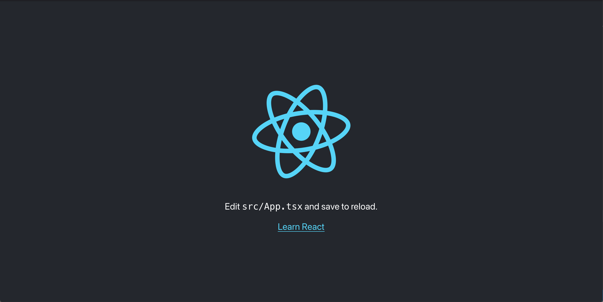
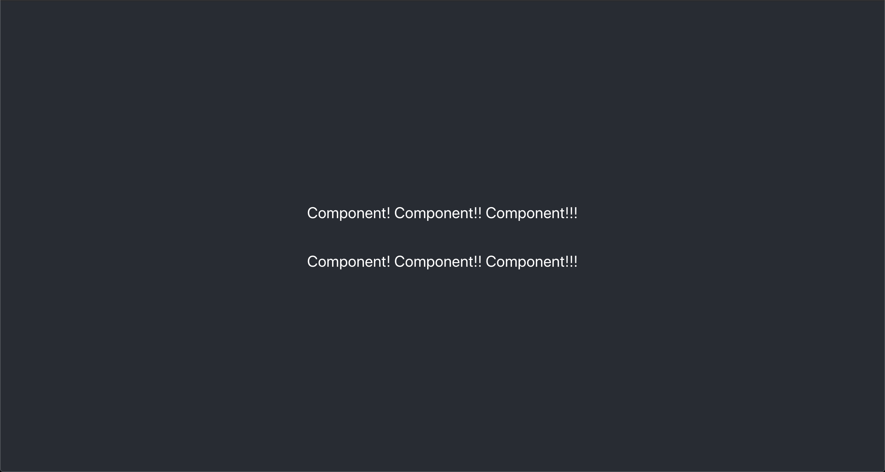
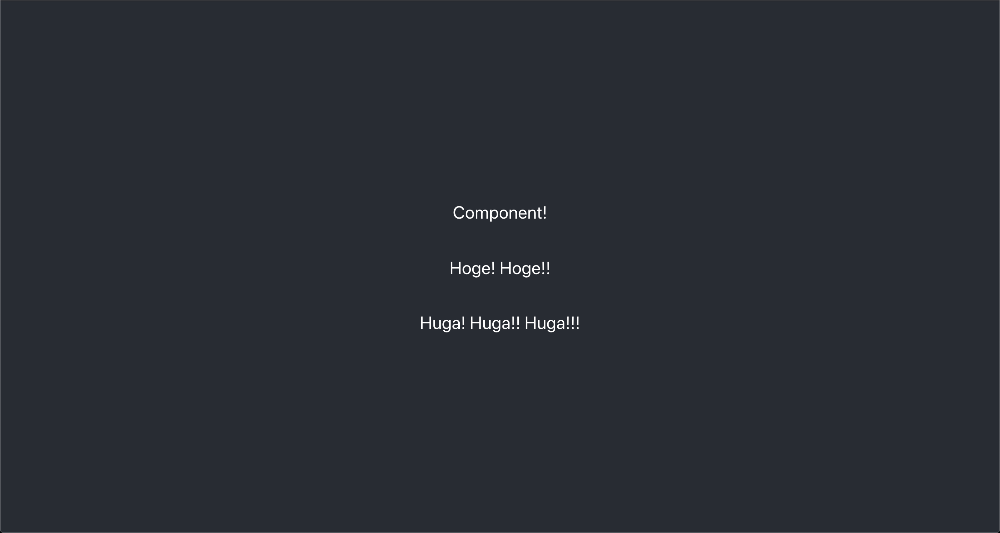

<header-table/>

# React でシングルページアプリケーションを書こう

## 始めに

本講義ではReactの動作原理を学びながら簡単なシングルページアプリケーションの作成を通して、今後の技術的な選択肢を増やすことを目的としています。

### 達成目標

- フロントエンド開発を経験する
- コンポーネントベース開発を経験する
- React開発の流れを理解する

### 本講義の前提

本講義ではプログラム言語共通の制御構文や概念、たとえばif文や型など、の解説は行いません。そのため、受講者は何らかのプログラミング言語で簡単な制御構文が書けることを前提とさせてください。

### この資料のお約束
:computer: は自分で操作する箇所を示しています。 また`$`はホストマシンのプロンプトを意味し、`❯`はコンテナ内部でのプロンプトを意味します。

たとえば下記の通りです。

```shell
# ホストマシン上で git clone git@github.com:iij/bootcamp.git を実行する
$ git clone git@github.com:iij/bootcamp.git

# コンテナ上で curl localhost:3000 を実行する
❯ curl localhost:3000
```

### 下準備
講義を受講する前にコンテナイメージのpullと起動をしておくことをお勧めしています。
また、Dockerの実行環境があることを前提として本講義を進めます。

#### 手順

1. ハンズオン用のDockerイメージをpullしてくる

```bash
# やや重たいので注意してください
$ docker pull ryusa/bootcamp-react:2021
```

2. コンテナを起動する

```bash
# コンテナを起動する
$ docker run --name bootcamp-react -itd -p 3000:3000 ryusa/bootcamp-react:2021
```

3. アプリケーションの起動チェック

```bash
# コンテナの中にアタッチする
$ docker exec -it bootcamp-react bash
# Reactの開発用サーバーを起動する
❯ npm start
# ...
# いろんなログが流れる
```

4. 動作チェック

ホストマシンから適当なブラウザ(※IEを除く)から[localhost:3000](http://localhost:3000)にアクセスし、Welcomeページが表示されることを確認してください。



## React とは

Reactは、もともと Facebook 社が開発している Web ユーザーインタフェースのためのフレームワークです。2021年6月現在のGoogleトレンドをみる限りフロントエンドフレームワークとしてのシェアは世界一位となっており、多種多様な場所で利用されています。\
IIJでもいくつかの製品のフロントエンドとしてReactが採用されています。

ReactはVueやAngularと同じくComponentベースでWebUIを実装していくフレームワークで、アトミックデザインとの相性が良くデザインに一貫性を持たせたい大規模なフロントエンド開発に非常にマッチしています。また型を持つTypeScriptとの相性も非常に良いため、開発者からの評価も高いです。

:::tip Create React App

React を始めるための方法としては、いくつかの方法があります。

- React の基礎を体験したい = オンラインサービスを使う
  - [CodePen](https://reactjs.org/redirect-to-codepen/hello-world)
  - [CodeSandbox](https://codesandbox.io/s/new)
  - [Glitch](https://glitch.com/edit/#!/remix/starter-react-template)
- 既存の HTML ページの中に React 埋め込みたい = 下記のチュートリアル
  - [Add React to a WebSite](https://reactjs.org/docs/add-react-to-a-website.html)
- フルに React を使ってアプリケーションを作りたい = Create ReactApp
  - [Create React App](https://facebook.github.io/create-react-app/docs/getting-started)

このハンズオンでは、最初から React を使うことを想定して CreateReactApp を使ったプロジェクトひな型を作成しています。詳細は[Dockerfile](https://github.com/iij/bootcamp/blob/master/src/frontend/react/dockerfiles/bootcamp-react/Dockerfile)を参考にしてください。

:::

## Reactハンズオン
実際にReactに触れてみましょう。本講義ではTypeScriptを使ってReactを書いていきます。

### Hello World

React の開発サーバは、ソースコードの変更を検知してその変更をブラウザに伝えてくれます。
さっそくひとつやってみましょう。

これから先、ファイルを編集することになるので別のシェルを取得して進めてください。

```bash
# 別のターミナルでシェルを取得しておく
$ docker exec -it bootcamp-react bash
❯ 
```

:computer: src/App.tsx を開き下記の通りに編集してください。

```tsx
import './App.css';

function App() {
  return (
    <div className="App">
      <header className="App-header">
        <p>Hello World!!</p>
      </header>
    </div>
  );
}

export default App;
```

編集して保存するとブラウザが自動的にリロードされ、下記のような画面に変わります。

※ 環境にとっては自動リロードしてくれない場合もあります。そのときはリロード(F5)をしてみてください。


#### チェックポイント
- React で Hello World を実施した

### コンポーネントを作成してみる

React は UI の部品を Component という単位に分割することで、ロジックやスタイルなどの再利用性を高めて実装を行います。

:::tip なぜ Component を使うのか

React ではなく Vue ですが、こちらの記事が非常にわかりやすい例です。Vue と React ともにコンポーネントベースのフレームワークですので、根幹は一緒です。

気になる人は読んでみてください。

[ワイ「何でそんな小っさいコンポーネント作ってるん？ｗ」 | Qiita](https://qiita.com/Yametaro/items/e8cb39b1a20b762bfafa)

:::

まず小さな Component を作ってみましょう。Component を記述する方法はいくつかありますが、まずクラスベースのコンポーネントを作成してみます。

:computer: src/Note.tsxを作成し、下記の通り編集してください。

```tsx
import React from "react";

interface NoteState {}
interface NoteProps {}

export default class Note extends React.Component<NoteProps, NoteState> {
  render() {
    return <p>Component! Component!! Component!!!</p>;
  }
}
```

:computer: さらに src/App.tsx が Note.tsx を使うように修正してください。

```tsx
import './App.css';
import Note from './Note'

function App() {
  return (
    <div className="App">
      <header className="App-header">
        <Note />
        <Note />
      </header>
    </div>
  );
}

export default App;
```

さあ、[localhost:3000](localhost:3000)にアクセスするとブラウザに表示されている内容が変化したと思います。



このように React では Component という UI 部品を組み合わせることでデザイン、UI を作成していきます。

#### チェックポイント

- クラスベースコンポーネントの書き方を学んだ
- Component の使い方を学んだ

### コンポーネントの機能 - 小要素へのデータの共有 : Props

`Note` コンポーネントを作成しましたが、今のままでは"Component! Component!! Component!!!"と叫ぶだけのコンポーネントで再利用性が悪いです。

他も文字を叫ぶことができるように、叫ぶ文字を外から渡してあげることができるようにしましょう。

:computer: src/Note.tsx を下記のように修正してみましょう。

```tsx
import React from "react";

interface NoteState {}
interface NoteProps {
  counter: number
  word: string
}

export default class Note extends React.Component<NoteProps, NoteState> {
  // (3, "Component") => "Component! Component!! Component!!!"
  constructWord = (counter: number, word: string) => {
    let words = "";
    [...Array(counter)].map((_: number, i: number) => words += word + "!".repeat(i + 1) + " ")
    return words.trimEnd()
  };

  render() {
    return <p>{this.constructWord(this.props.counter, this.props.word)}</p>;
  }
}
```

:computer: src/App.tsxを修正してください。

```tsx
import './App.css';
import Note from './Note'

function App() {
  return (
    <div className="App">
      <header className="App-header">
        <Note counter={1} word={"Component"} />
        <Note counter={2} word={"Hoge"} />
        <Note counter={3} word={"Huga"} />
      </header>
    </div>
  );
}

export default App;
```

ここまで修正すると、下記の通りにブラウザの表示が変わります。



親コンポーネントからデータを注入できるように`props`を適切に定義することで、Component の再利用性をあげることができます。
注意が必要なこととして`props`は Readonly なため、`props`の中身を書き換えたりすることはできません。

#### チェックポイント

- Component の `Props` について学んだ
- Component 間のパラメータの受け渡し方を学んだ

### コンポーネントの機能 - 内部データストア : State

`props`フィールドを通じてコンポーネント間のデータの受け渡しはできましたが、ユーザーからの入力や外部から取得した情報はどのように保存するべきでしょうか？
Component には State というデータの保存する機構が付属されています。試しに、ユーザーがボタンを押した数だけ叫ぶ回数を増やすように実装してみましょう。

:computer: src/Note.tsx を下記の通りに修正してください。

```tsx
import React from "react";

interface NoteState {
  counter: number
}

interface NoteProps {
  word: string
}

export default class Note extends React.Component<NoteProps, NoteState> {

  constructor(props: NoteProps) {
    super(props)
    // Stateの初期化
    this.state = {
      counter: 1
    }
  }

  // クリック時のハンドラー
  onClickHandler = () => {
    // StateをsetStateメソッド経由で更新
    // setStateでStateを更新するとDOMの再レンダリングが行われます
    this.setState({
      counter: this.state.counter + 1
    })
  }

  // (3, "Component") => "Component! Component!! Component!!!"
  constructWord = (counter: number, word: string) => {
    let words = "";
    [...Array(counter)].map((_: number, i: number) => words += word + "!".repeat(i + 1) + " ")
    return words.trimEnd()
  };

  render() {
    return (
      <>
        {/* ボタンをクリックされたらclick()メソッドが発火し、Stateが更新される */}
        <button onClick={this.onClickHandler}>
          Click me!!
        </button>
        {/* Stateのカウンタの数だけ叫ぶ */}
        <p>{this.constructWord(this.state.counter, this.props.word)}</p>
      </>
    )
  }
}
```

:computer: さらに下記の通りにsrc/App.tsxを修正してください。

```tsx
import './App.css';
import Note from './Note'

function App() {
  return (
    <div className="App">
      <header className="App-header">
        <Note word={"Component"} />
        <Note word={"Hoge"} />
        <Note word={"Huga"} />
      </header>
    </div>
  );
}

export default App;
```

ここまで修正すると下記の通りになります。


State は Component の内部でのみ生きているデータベースのようなものです。State を`setState`メソッド経由で更新を行うと、関連するコンポーネントや DOM が自動で更新されます。

実際に"Click me!!"のボタンをクリックしてみてください。

#### チェックポイント

- State を利用してコンポーネント内部で使えるローカルストアを作成できる
- `setState` メソッドで State を更新すると DOM が自動でリロードされる

:::tip Redux

State を利用することで、単一のコンポーネントでデータを保存できることがわかりました。しかし認証やフォームデータなど複数のコンポーネントを跨ってグローバルに書き込みを行いたい場合もあります。また State をもっと複雑に利用したいケースもでてきます。

その場合は Redux というモジュールを使うと良いでしょう。Redux はアプリケーションの状態を管理するためのモジュールで React と親和性が非常に高いためよく利用されます。

ただし Redux は扱いに癖があり、ハンズオンなどの短い時間での導入が難しいためこのハンズオンでは紹介にとどめておきます。

詳しくはこちら > [React Redux](https://react-redux.js.org/introduction/quick-start)

:::

### コンポーネントの機能 - ライフサイクル管理: LifeCycle

少しコンポーネントの複雑な機能について触れてみましょう。Component を作成することに注力しましたが、ここでは Component の作成の方法に注視してみましょう。

コンポーネントの中にはWebsocketやHTTP SSEを利用した購読を行うものも多々あると思います。\
このように多くのWebサイトで「画面の初期表示のタイミングで外部からデータを取得して画面に表示する」というケースを見かけます。この機能はComponentのライフサイクルを利用することで実現できます。実装してみましょう！

:computer: src/Note.tsxを下記のように修正します。

```tsx
import React from "react";

interface NoteState {
  counter: number
  isLoaded: boolean
}

interface NoteProps {
  word: string
}

// ただ時間待ちするだけのタスク
const someHeavyTask = (handler: () => void) => {
  setTimeout(() => {
    handler()
  }, 2000)
}

export default class Note extends React.Component<NoteProps, NoteState> {

  constructor(props: NoteProps) {
    super(props)
    this.state = {
      counter: 1,
      isLoaded: false // 初期ではロード中扱い
    }
  }

  // DOMツリーにコンポーネントが追加された直後に呼び出されるメソッド
  // React.Componentに定義されているメソッドです
  componentDidMount = () => {
    someHeavyTask(
      () => this.setState({
        isLoaded: true
      })
    )
  }

  onClickHandler = () => {
    this.setState({
      counter: this.state.counter + 1
    })
  }

  constructWord = (counter: number, word: string) => {
    let words = "";
    [...Array(counter)].map((_: number, i: number) => words += word + "!".repeat(i + 1) + " ")
    return words.trimEnd()
  };

  render() {
    const loading = <p>Loading...</p>
    const component =
      <>
        <button onClick={this.onClickHandler}>
          Click me!!
        </button>
        <p>{this.constructWord(this.state.counter, this.props.word)}</p>
      </>

    // StateのisLoadedがfalseの場合、"Loading..."が表示されます
    const note = this.state.isLoaded ? component : loading
    return note
  }
}
```

一瞬"Loading..."という文字列が見えた瞬間、画面表示されるようになったと思います。


初めて出てきた`componentDidMount`メソッドは`React.Component`で定義されているメソッドで、ブラウザ上にコンポーネントが描画された直後に走るメソッドです。

React のコンポーネントは`componentDidMount`のようにいくつかのライフサイクル用のメソッドが用意されています。
これらのライフサイクルメソッドを利用することでコンポーネントの初期化や後処理を定義できます。


それぞれのタイミングで実施したい処理があれば、それぞれのメソッドの中に実装してあげると良いでしょう。

詳しくはこちら > [state とライフサイクル | React Docs](https://ja.reactjs.org/docs/state-and-lifecycle.html)

#### チェックポイント
- コンポーネントにライフサイクルがあることを理解した
- ライフサイクルに合わせてフックを作成することができた

### Hooksを導入する
Reactのコンポーネントを表現する方法としてクラスベースなやり方を見てきました。\
クラスベースなコンポーネントは便利な一方でライフサイクルが読み取りにくくなる傾向にあり、複雑なコンポーネントになるほどメンテナンス性が悪くなりがちです。

元に、最初はシンプルだった`Note`コンポーネントもだいぶ大きくなりライフサイクルが入り乱れわかりにくくなってしまいました。(そうなるように書いてもらった、のですが……)

ReactにはReact Hooksという機能が存在しており、これは最初に紹介した関数型コンポーネントにも簡単なライフサイクルの管理とステートの保持の機能を接続することができるものです。

詳細：https://ja.reactjs.org/docs/hooks-intro.html

実際にReact Hooksで今までの実装を再実装してみましょう！

:computer: 新たにsrc/NewNote.tsxを作成し、下記の通り記述してください。

```tsx
import { useEffect, useState } from "react";

interface NoteProps {
  word: string
}

const someHeavyTask = (handler: () => void) => {
  setTimeout(() => {
    handler()
  }, 2000)
}

// 関数型コンポーネントとして定義します
// ライフサイクルは基本的に「上から下」に流れていきます
export default function Note(props: NoteProps) {

  // Stateはシンプルに`useState`で定義します
  // 第一返値にStateそのもの、第二返値にStateの更新トリガーが入ります
  // 更新トリガーを経由してStateを更新することで後述の`useEffect`を呼び出すことになります
  const [counter, setCounter] = useState<number>(1)
  const [isLoaded, setIsLoaded] = useState<boolean>(false)

  // 副作用フック
  // componentDidMountなどに相当している挙動をするものです
  useEffect(() => {
    someHeavyTask(() => {
      setIsLoaded(true)
    })
    // 返り値にコールバックを指定することで、componentWillUnMountに相当する挙動を行うことができます
    // たとえば、WebSocketの破棄などを指定することが多いです
    // return () => FooBar
  })

  const onClickHandler = () => {
    setCounter(counter + 1)
  }

  const constructWord = (counter: number, word: string) => {
    let words = "";
    [...Array(counter)].map((_: number, i: number) => words += word + "!".repeat(i + 1) + " ")
    return words.trimEnd()
  }

  const loading = <p>Loading</p>
  const component =
    <>
      <button onClick={onClickHandler}>
        Click me!!
      </button>
      <p>{constructWord(counter, props.word)}</p>
    </>

  // 関数型コンポーネントなのでDOMを返却するだけ
  return isLoaded ? component : loading  
}
```

:computer: src/Apps.tsxでNoteのimport元を差し替えてください。

```tsx
import './App.css';
import Note from './NewNote'

function App() {
  return (
    <div className="App">
      <header className="App-header">
        <Note word={"Component"} />
        <Note word={"Hoge"} />
        <Note word={"Huga"} />
      </header>
    </div>
  );
}

export default App;
```

今回はあくまでもUIコンポーネントの構造をクラスベースなものから関数ベースなものに差し替えただけなので、見た目上UIが変わっていないはずです。

#### チェックポイント
- React Hooksを利用してコンポーネントを実装した

### デプロイしてみよう
さて、これまでは開発サーバーでReactを動かしてきました。実際にReactで作成したSPAをビルドしてWebサーバーから配信してみましょう。

:computer: Reactプロジェクトをビルドします。

```bash
# プロジェクトルート上でビルドします
❯ npm run build
# 成果物があることを確認します
❯ ls  build/
asset-manifest.json  index.html   logo512.png    robots.txt
favicon.ico          logo192.png  manifest.json  static
```

:computer: 成果物をホストマシンにコピーしてきます

```bash
# 成果物を適当なディレクトリにコピーしてきます
$ docker cp bootcamp-react:/app/build ./
```

:computer: nginx上にSPAをデプロイ

```bash
# buildディレクトリをそのままマウント
$ docker run --rm -d -p 9000:80 --name react-prod -v ${PWD}/build/:/usr/share/nginx/html/ nginx:latest
```

以降ホストマシン側のlocalhost:9000へアクセスすると、先ほど作成したSPAが画面に表示されているはずです。


# 最後に

以上で React のハンズオンは終了です。

昨今のフロントエンド界隈は比較的落ち着いてきた(=デファクトが固まりつつある)印象がありますが、それでも流行り廃りの早い世界です。この文書も、いつ時代遅れになるかもわかりません。

ですが、フロントエンドはアプリケーションの花形です。ぜひフロントエンドの知見を日々広げ、花形の開発者として活躍してもらえればうれしいです。

## 読み物

ここから先は React に関する情報をまとめた読み物です。興味のある人はさっと目を通してみてください。

### SPA はどこへ？

Bootcamp 冒頭で

> React でシングルページアプリケーション(=SPA)を書こう

と書いておきながら、SPA という言葉が一切出てきませんでした。実は、すでにこの Bootcamp で作成したコードが SPA になっています。

[シングルページアプリケーション | Wikipedia](https://ja.wikipedia.org/wiki/シングルページアプリケーション)

- サーバから配信する HTML は単一
  - 画面遷移が滑らか＆爆速
- フロントエンドの DOM の操作を JavaScript で行う
  - 物理 DOM の操作と比べて軽量

といったことが特徴です。create-react-app で構成したプロジェクトはデフォルトで SPA となっています。SPA でないものとして SSR(=サーバサイドレンダリング)が挙げられます。


<credit-footer/>
