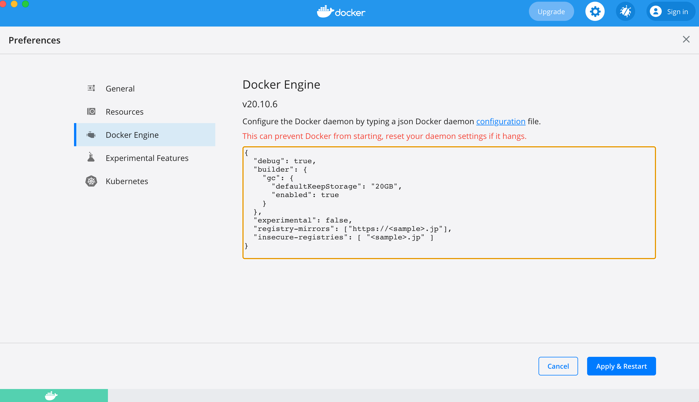

<header-table/>

# ハンズオン事前準備

各ハンズオンに取り組む前に、各ハンズオン用の環境を [Docker](https://www.docker.com/) で動かせるように準備します。

## Docker のインストール (Check.1)

各 OS やプラットフォームごとのインストール方法はここにドキュメントがあります。
[Install Docker Engine](https://docs.docker.com/engine/install/)

この資料では Windows と macOS について、簡単に取り上げます。

### Windows

windows の場合 [docker-for-windows](https://docs.docker.com/docker-for-windows/) を使うのがおすすめです。WSL や仮想環境に linux を立てることもできますが、ネットワークのトラブルなどが頻発するため現状あまりお勧めしません。

1. [ダウンロードページ](https://hub.docker.com/editions/community/docker-ce-desktop-windows/) にアクセスし、「Get Docker」をクリックして exe ファイルをダウンロードします。
   - stable 版で問題ありません
2. ダウンロードした exe ファイルをクリックしてインストールします。
3. PowerShell やコマンドプロンプトを開き、`docker version`コマンドが実行できれば成功です。

```terminal
>docker --version
Docker version 20.10.7, build f0df350
```

### Mac

Mac の場合は [docker-for-mac](https://docs.docker.com/docker-for-mac/) を使います。

1. [ダウンロードページ](https://hub.docker.com/editions/community/docker-ce-desktop-mac/) にアクセスし、「Get Docker」をクリックして dmg ファイルをダウンロードします。
2. ダウンロードした dmg ファイルをクリックしてインストールします。
3. terminal を開き、`docker version`コマンドが実行できれば成功です。

```terminal
$ docker --version
Docker version 20.10.6, build 370c289
```

## Hello Docker

### ミラーサーバの設定

（ちょっと長い説明）

Dockerで何かコンテナを動かす際にはイメージファイルが必要になります（詳しくはDockerハンズオンで）。
デフォルトではイメージファイルは[dockerhub](https://hub.docker.com/)というDocker社公式のサービスからダウンロードできますが、少し前から同一IPアドレスから大量にアクセスがあるとアクセス制限がかかるようになりました。

会社のネットワークから外部のサイトにアクセスする際は必ずプロキシサーバを経由しますが、社内から全員がdockerhubにアクセスするとプロキシサーバのIPアドレスが簡単にアクセス制限の対象になってしまいます。

そこでイメージファイルをキャッシュしておくための社内ミラーサーバが立っていますので、そちらを使う設定を追加します。

Dockerのアプリを立ち上げ、Preferences > Docker Engine を開いてください。



画像では色々と書いてありますが、必要なのは以下の設定です。下記の項目を追加してください。

```json
{
    "registry-mirrors": ["https://<sample>.jp"],
    "insecure-registries": [ "<sample>.jp" ]
}
```

ミラーサーバーのURLは社内で利用可能なものを設定してください。

記述を追加したら`Apply & Restart`で再起動します。その後再びterminalから`docker system info`というコマンドを実行してください。

```terminal
$ docker system info
Client:
 Context:    default
 Debug Mode: false
 Plugins:
  app: Docker App (Docker Inc., v0.9.1-beta3)
  buildx: Build with BuildKit (Docker Inc., v0.5.1-docker)
  compose: Docker Compose (Docker Inc., 2.0.0-beta.1)
  scan: Docker Scan (Docker Inc., v0.8.0)

Server:
...
 Insecure Registries:
  <sample>.jp
  127.0.0.0/8
 Registry Mirrors:
  https://<sample>.jp/
...
```

`Insecure Registries`と`Registry Mirrors`に先ほど設定した値が入っていれば成功です。

### hello-world コンテナを動かす (Check.2)

hello-world コンテナをダウンロードして、実際に docker で動かしてみます。

```terminal
$ docker run hello-world
Unable to find image 'hello-world:latest' locally
latest: Pulling from library/hello-world
b8dfde127a29: Pull complete
Digest: sha256:9f6ad537c5132bcce57f7a0a20e317228d382c3cd61edae14650eec68b2b345c
Status: Downloaded newer image for hello-world:latest

Hello from Docker!
This message shows that your installation appears to be working correctly.
...
```

`Hello from Docker!`が表示されていれば成功です。

### 失敗した場合

以下のようなエラーで失敗した場合 proxy の設定が必要な場合があります。

```terminal
Unable to find image 'hello-world:latest' locally
docker: Error response from daemon: Get https://registry-1.docker.io/v2/: net/http: request canceled while waiting for connection (Client.Timeout exceeded while awaiting headers).
See 'docker run --help'.
```

「docker {OS 名} proxy」などで検索すると、以下のような記事が検索されると思うので、参考にしながら設定してみてください。

- Windows: https://qiita.com/wryun0suke/items/1f4bbd2977ae41ee7a36
- Mac: https://qiita.com/kobakou/items/214129924b9cd3e64d0f

proxy の URL は環境によって異なるため、周りの誰かに確認してください。

### それでもダメな場合 or 違うエラーの場合

TA や講師など、周りの先輩に遠慮なく声をかけてください。

## Nginx を立てて手元で HTML を書き換える

次は docker の [volumes](https://docs.docker.com/storage/volumes/) という機能を使い、コンテナの中のファイルを手元で編集できるようにしてみます。
これができると docker 環境で動かすファイルを手元のエディタで編集できるためとても便利です。

ここでは Nginx という web サーバーを使い、簡単な HTML ファイルをホスティングしてみます。そしてその HTML ファイルを手元で書き換えてみましょう。

### HTML ファイルの作成

以下のようにディレクトリを作成し、その中に html ファイルを作成してください。

```terminal
mkdir content
vim content/index.html // メモ帳などでも可。 vimから抜けるには ESCキーを押した後「:wq<Enter>」を入力してください。
```

`index.html`の内容はなんでもいいですが、例えば以下のようにしてみましょう。

```html
Hello Bootcamp!
```

### docker コンテナの起動 (Check.3)

HTML ファイルが作成できたら、nginx の docker コンテナを以下のように起動します。

windows

```terminal
$ docker run --name test-nginx -p 8080:80 --mount type=bind,source=%CD%/content,target=/usr/share/nginx/html,ro -d nginx
47fb496ed83cb26558874e8fd6b6fff4303031a2b24f827a938310ee9646c638
```

mac/linux

```terminal
$ docker run --name test-nginx -p 8080:80 --mount type=bind,source=$PWD/content,target=/usr/share/nginx/html,ro -d nginx
47fb496ed83cb26558874e8fd6b6fff4303031a2b24f827a938310ee9646c638
```

エラーなく起動できたらブラウザを開き、[localhost:8080](http://localhost:8080) （`localhost`または ssh 先の IP アドレス）にアクセスしてみましょう。「Hello Bootcamp!」が表示されていれば成功です。

### HTML ファイルを書き換える

先ほど作成した`index.html`を編集してみましょう。

```html
Hello Bootcamp!!!!!!
```

保存してブラウザをリロードしてみてください。ページが更新されていれば成功です。

## Docker コンテナのお掃除

最後に Docker コンテナを止めて掃除しておきます。

```terminal
docker stop test-nginx
docker rm test-nginx
```

以上で事前準備は完了です。お疲れ様でした。
