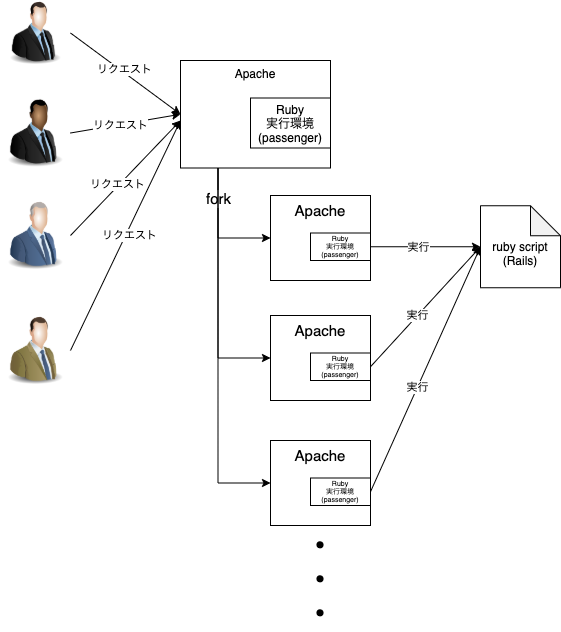
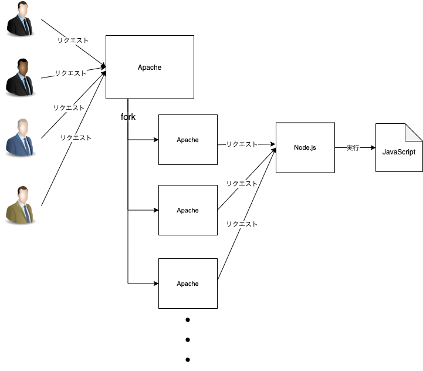
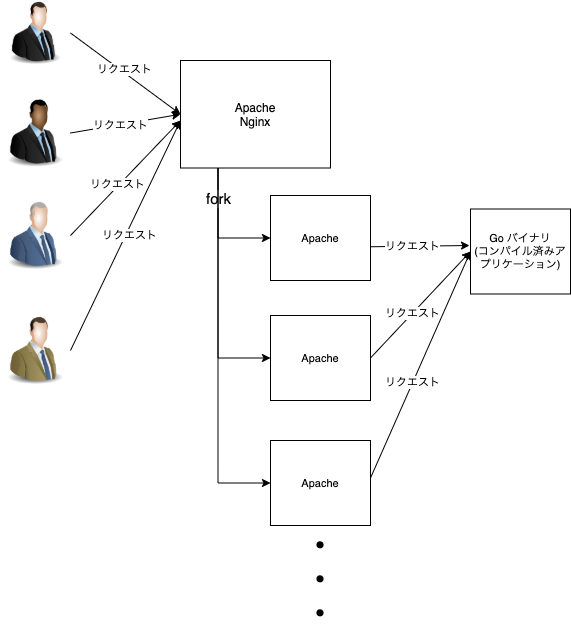

# サーバアプリケーション界隈概要

ここでいうサーバアプリケーションとは、Webアプリケーションを構成する要素の中のサーバサイドの実装技術のことをなんとなく表現しています。

## 目次

1. CGI
2. PHP
3. サーブレット
4. Java EE / Spring
5. Ruby on Rails
6. Ajaxの出現 / フロントエンド+APIサーバの時代
7. Node.jsとクラウド
8. Goとマイクロサービス

## CGI

（1993年 フォーマルな仕様制定は1997年）

```perl
#!/usr/bin/perl

print "Content-type: text/html \n\n";
print "<html>";
print "<head><title>IIJ Bootcamp</title></head>";
print "<body>";
print "<p>Welcom to IIJ Bootcamp</p>";
print "</body>";
print "</html>";
```

1. Common Gateway Interface
2. ApacheなどのWebサーバでHTTPリクエストを受けて、外部プログラムにHTTPリクエストを渡し、出力をHTTPレスポンスとして返すしくみ。
3. Perlが大流行するきっかけとなった。
   - Perlは文字列処理が強力（C言語は文字列処理が貧弱）
   - PerlからMySQL/PostgreSQLに接続してHTTPレスポンスを生成するスタイル
4. 今日でもPerlで実装されたプロダクトは存続している（MovableTypeとか、mixiとか。CookPadもPerlでスタートしたはず)。

## PHP

```php
<html>
 <head>
  <title>IIJ Bootcamp</title>
 </head>
 <body>
 <?php echo '<p>Welcom to IIJ Bootcamp</p>'; ?> 
 </body>
</html>
```

（開発開始は1994年 実質的に最初の公開版PHP 3が1997年 本格普及はPHP 4で2000年)

1. CGIはHTTPリクエストを受けるごとに、新しいプロセスをforkする必要があり、Webサーバにとって負荷が高かった。
2. WebサーバのモジュールとしてPerlを動作させる方法が考案された（mod_perl 1998年)。
   1. しかしPerlはWebサーバのモジュールとして動作させる前提で設計/実装されたものではなく、やや使い勝手が悪かった。
   2. 類似の技術としてFastCGIというものもあり、これは常駐プロセスとしてCGI実行エンジンを用意しておき、HTTPリクエストを常駐プロセスに流し込むという方法。やはり癖があった。
3. 最初からWebサーバのモジュールとして実行することを念頭に置いた、Webプログラミングに特化した処理系としてPHPが登場、大流行してPerlを駆逐する。
   1. Facebookも長い間PHPで書かれていた。

### Perl CGI


### mod_perl


## サーブレット

（1996年に初期バージョンが公開 1998年に最初の公式API仕様が確立 2001年にStrutsが登場)

```java
<%@ page contentType="text/html" %>

<html>
<head>
<title>IIJ Bootcamp</title>
</head>
<body>
<p>
<% System.out.println("Welcom to IIJ Bootcamp"); %>
</p>

現在時刻: <%= new java.util.Date() %>

</body>
</html>
```

1. 1995年Sun Microsystems社がJava言語を売り出した。
   - 最初にアピールした`Applet`は、Webページの中にJavaのサンドボックス環境を埋め込んでアプリケーションを実行するというものだった。しかし制約が大きいうえにマシンパワーを要求するので、実用的なアプリケーションを作る環境としては、流行らなかった。
2. しかしサーバサイドの技術として発表されたサーブレットは2000年ごろから流行し始め、2001年にStrutsが登場するとその人気は決定的になった。
    1. サーブレットはHTTPリクエストを（CGIのようにプロセスをforkするのではなく)スレッドで処理するので性能が高かった。
    2. Javaは静的に型付けされた言語であるため、Javaで書かれたアプリケーションはPHPよりも品質を確保しやすいかった。
    3. WebアプリケーションフレームワークであるStrutsを使うと、プログラムを一定のスタイルで記述することを助け、同時に大人数で分業することを助けた。規模の大きなエンタープライズシステムの実装が可能になった。
    4. Javaで書かれたコードはポータビリティがあり、サーバのOSやCPUが変わっても、そのまま実行できた。（まだx86系のCPUが市場を独占しておらず、SPARCやAlphaなどのCPUもある程度のシェアを持っていた。)
3. かくしてカジュアルな（コンシューマ向けの）WebアプリケーションはPHPで、シリアスな（エンタープライズ向けの）WebアプリケーションはJavaサーブレットで書く、という時代が続くことになった。

## Java EE / Spring

（Java EE 1999年 / Spring 2002年）

※ サンプルは適当です

JavaEE

```java
@ManagedBean(name="HelloBootcamp")
@RequestScoped
public class HelloBootcamp {
   private String message;

   /** Creates a new instance of HelloBootcamp */
   public HelloBootcamp() {
      this.message = "Welcom to IIJ Bootcamp";
   }

   *@EJB
   private MessageFacade messageFacade;*

   public String getMessage() {
      return this.message;
   }
}
```

Spring Framework

```java
@RestController
public class HelloController {

   @RequestMapping("/")
   public String index() {
      return "Welcom to IIJ Bootcamp";
   }

}
```

1. Sun Microsystemはサーブレットの成功に気を良くして、これを一層強力に推進してエンタープライズの世界を支配しようと試みた。そうして出てきたのはJava EE（Enterprise Edition）であった。
2. Java EEは、エンタープライズアプリケーションを多数のサーバの連携する分散処理を通じて実現することを構想し、その中核技術としてEJB（Enterprise JavaBeans）を据えた。EJBを使うと、ネットワーク越しにJavaのオブジェクトが通信し合い、データベースへの永続化も含めてエレガントに処理できるはずだった。Sun Microsystemsの制定したJava EE仕様を実装するアプリケーションサーバ製品が複数のベンダーから出荷され、活況を呈した。
3. だが、実際のJava EEアプリケーションサーバ製品は不安定で性能も悪く、プログラミングも難しいものであった。人々はJava EEを信じて使い続けていたが、疑問も大きく膨らんでいった。
4. そこに登場したのがSpring Frameworkだった（2002年頃）。
   - 作者のRod JohnsonがExpertt One-on-One J2EE Design and Developmentとともに世に問うたもの。
   - Java EE（J2EE) の欠点を指摘し、EJB、とりわけ`Entity Beans`を使うことは断念し、POJO（Plain Old Java Object) をベースに開発することを提唱した。
   - DI （Dependency Injecttion) のアイデアを普及させ、大規模なJavaアプリケーションを効率よく分業体制で実装する道を切り開いた。
5. Spring Frameworkは一世を風靡しただけでなく、今日まで人気を失うことなく、利用されている。
   - StrutsはStrus1の後継バージョンであるStruts2が、Struts1とまったく互換性がなかったため、Struts1を採用していた開発会社に受け入れられなかった。
   - その後脆弱性問題を連発したため、今日ではまったく人気がない。

## Ruby on Rails

```ruby
class HelloController < ApplicationController

   def hello
      render :html => '<p>Welcom to IIJ Bootcamp</p>'
   end
end
```

1. 2004年、37signales社がbasecampというプロジェクト管理アプリケーションの実装に使用していたRuby on RailsというWebアプリケーションフレームワークを発表した。Railsは非常にインパクトのあるフレームワークで、以降のサーバサイドプログラミングの世界を一変させてしまった。
2. その特徴を列挙すると以下のとおり。
   1. 2つの哲学。「同じことを繰り返さない DRY: Don't repeat yourself」「設定より規約 Convention over Configuration」
      - Strutsでは互いに関連し合う複雑な設定ファイルが多く必要だった
         - ルーティング（あるURLをどのアクションクラスで処理するかのマッピング）やアクションが処理するリクエストのフォームを記述するクラス、テンプレートの中で使用するタグライブラリの定義など
         - ほとんどの設定項目は、自動的なものであり、設定ファイルのメンテナンスは大量の単純作業であった。
      - そこで多くの現場ではExcelなどで主要設定項目を管理し、そのExcelファイルからマクロで個々の設定ファイルを生成するようなことが行われていた。
      - Railsでは、これを「デフォルトで定められているディレクトリ構造や命名規則に沿っている限り、設定ファイルは不要とする（特別な場合だけ、設定ファイルを書く）」という方法で解決した。
      - たとえばRDBMSのpersonテーブルに対応するモデルクラスを、ModelsディレクトリにあるPerson.rbファイルとして記述すれば、自動的にDBアクセス可能とするというような具合である。
      - こうした開発者体験(Developer Experience)の良さは、Rubyが非常にメタプログラミングをしやすい言語であることで成り立っている。
         - Rails 独自の拡張や構文を多数実装することで、上記の哲学を実現している。
   2. コマンドラインユーティリティによる開発のサポート
      - たとえばあるURLに対応するコントローラクラスのスケルトンをコマンドラインユーティリティから生成できる。
      - このようなユーティリティを提供することで、開発者を単純作業から解放し、価値あるコードを書くことへ集中できるようにした。
   3. Ruby on Railsに触発されて、別の言語でも同様のフレームワークが多数開発された。
      - PHP: CakePHP
      - Java: JBoss Seam, Java EE 6, Grails（Groovyを使う)
      - Python: Django

```bash
rails generate controller User name:string email:string
```

```ruby
class User < ActiveRecord::Base
   attr_accessible :password, :username
end
```

```ruby
user = User.find(1) # id=1なデータをDBで検索する

User.create(password: 'hogehoge', username: 'hugahuga') # データの作成（DBにinsert）
```

## Ajaxの出現 / フロントエンド+APIサーバの時代

1. Google MapsおよびGmailの出現により、「画面遷移を伴わないWebアプリケーション」というものがユーザーに認知され始めた。2005年ごろのことである。
2. Googleのエンジニアたちの使った技法は、技術としてはそれ以前から存在していたが誰も注目してこなかったXMLHttpRequestというJavaScriptの機能を初めて本格的に使用するものだった。
   1. この技法をAsynchronous JavaScript + XMLの頭文字をとってAjax （エイジャックス) と呼ぶようになった。
3. StrutsやRuby on Railsはサーバサイド（バックエンド）側でリクエストを処理して画面も生成するというようなスタイルが中心だった。しかしAjaxが人気を集めるようになるとクライアント（フロントエンド）側で画面描画をすべて行い、バックエンドにはAPIサーバのみを置くというスタイルが人気を集めるようになった。
   1. 画面遷移を伴わないWebアプリケーションのことをSPA （Single Page Application) などと呼ぶ。
   2. このスタイルが定着すると、デスクトップアプリケーションと比較しても遜色ないUIのWebアプリケーションが当たり前のように期待されるようになっていった。
   3. 要求の高度化に応えるため、フロントエンド側のフレームワークが非常に速いペースで開発されているのが今日の状況である。今日、人気のあるフロントエンド・フレームワークとしてReact （Facebook)、Angular （Google)、Vue.js （Evan You)などがある。

## Node.js

Perlから始まり、ここまで出てきたJavaやRailsは基本的に同期的なI/Oとシングルプロセスで動作する。
そのため複数のリクエストを同時に処理するためにはApacheなど外部のツールによってマルチプロセス化し、1つのリクエストを1プロセスに割り当てる形でレスポンスを返している。



しかしインターネット利用者に増加にともなってWebサービスへのアクセス量も増え、processのforkによる処理モデルの限界が表面化してきた。1サーバあたりで起動できるプロセス数には限界がある他、プロセスを作るコスト（メモリ消費など）が無視できなくなってきたのである。

::: tip
たとえば32bit環境のlinuxサーバでは、プロセスの管理番号の上限にあたるため32768がシステム上の限界値となる。
また１スレッドあたり数MBのメモリを使うとすると、8GBのメモリを積んだサーバでは4000ほどが上限になる。
（あくまで単純に計算した場合の理論値）
:::

この問題への解決として、Node.jsをはじめとした非同期I/OとEventDrivenなアーキテクチャが注目された。
Node.jsはJavaScriptの実行環境の一つで、I/O待ち（HDDへの書き込みなど）中に他の処理を行うことで、1プロセスで複数のリクエストを同時に処理することができる。



開発スタイルの特徴としては以下が挙げられる。

- フロントエンド開発と同じJavaScriptで書けるので、1サービスを作るのに複数の言語を扱わなくてよくなる
- 豊富なライブラリやツールの選択肢がある
- 反面EventDrivenな実装はコードが複雑になりがちで、どちらかというと小規模な実装向け
  - TypeScriptによる型の導入やasync/await記法の導入などで改善されつつはある
- できるだけ自分で実装せずにライブラリを使うことがよしとされる風潮があり、ライブラリの依存関係が膨らみがち
  - 正しくはあるが、小さな機能のために追加ライブラリをパッケージする必要があり、依存関係の複雑さやビルド時間の増加を招く
  - rubyの頃からある業界的な課題ではあるが、Node.jsでは特に顕著

最近ではSPAフレームワークからの流れでSSR(Server Side Rendering)を採用するサービスも増えており、その実行環境としてNode.jsが引き続き使われている。

## Go

2016年くらいから利用例の増えてきたプログラミング言語で、静的型付け・シンプルな言語体系・高速な動作・並行処理が得意などの特徴がある。
RubyやPythonなどのスクリプト言語のような開発スピードと、JavaやCのような静的型付けによる安全性・実行の速さを両立していることで、Webサービスのバックエンドとして使われることが増えた。
RubyやPython、Javaなどの実行環境をインストールする必要がなく、コンパイルしたバイナリファイル1つで動作するため、デプロイや環境構築が容易なのも特徴。
さらにGo自体が並行処理が得意なため、1プロセス内で並行処理をすることでプロセスをforkする必要がない。



開発スタイルとしては以下のような特徴がある。

- あまりライブラリやフレームワークを使わずに、自分で実装することが推奨される
  - 標準ライブラリの優秀さと、静的型付けによるバグの少なさがそれを可能にしている
- goroutineという仕組みで簡単に並行処理が書ける
- 言語仕様がシンプルなのと静的型付けなこともあり、linterやコード補完ツールが作りやすい
- コーディング規約がある程度公式で決まっており、誰が書いても同じ書き方になる
  - 複数人での開発がやりやすい
- コンパイル言語なので（スクリプト言語に比べると）デバッグが難しい
- Railsのようなフレームワークに頼らず、自力でアプリケーションを構築していく必要がある

## まとめ

PerlCGIから始まり、Webアプリケーション開発の大まかな流れを追ってきた。
ここ数年の流れとしては、2015年頃？に富豪プログラミング＋動的型付けによる素早い開発が流行した流れを受け、小さく高速な処理と静的型付けなどによるバグの少ない開発を目指すのが主流になりつつある（個人の感想です）。

一方でRailsなどのフレームワークを使ったときの開発効率は今でも非常に優秀で、サービスのスタートアップではRailsを採用するケースがまだまだあると思われる。

個人的な所感をざっくりまとめると以下のようになる。

- 手堅く大規模な開発に向いたJava
- 小さめで高速なアプリケーションを作るのに向いたGoとNode.js
- 開発効率に優れたRailsやDjango
- フロントまで含めて軽量で素早い開発が可能なPHP

ただしどの言語を採用するかはサービス全体のアーキテクチャや開発スタイルにもよるため、周辺事情もよく考える必要がある。

<credit-footer/>
