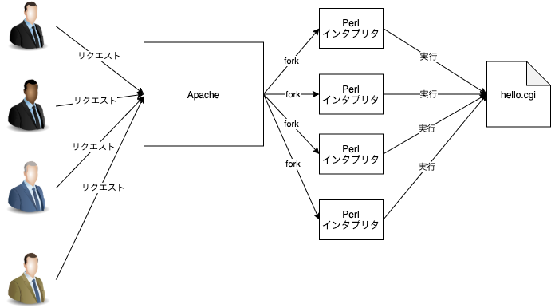
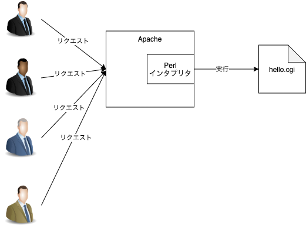

# サーバアプリケーション界隈概要

ここでいうサーバアプリケーションとは、Webアプリケーションを構成する要素の中のサーバサイドの実装技術のことをなんとなく表現しています。

## 目次

1. CGI
2. PHP
3. サーブレット
4. Java EE / Spring
5. Ruby on Rails
6. Ajaxの出現 / フロントエンド+APIサーバの時代
7. Node.jsとクラウド
8. Goとマイクロサービス

## CGI

（1993年 フォーマルな仕様制定は1997年）

```perl
#!/usr/bin/perl

print "Content-type: text/html \n\n";
print "<html>";
print "<head><title>IIJ Bootcamp</title></head>";
print "<body>";
print "<p>Welcom to IIJ Bootcamp</p>";
print "</body>";
print "</html>";
```

1. Common Gateway Interface
2. ApacheなどのWebサーバでHTTPリクエストを受けて、外部プログラムにHTTPリクエストを渡し、出力をHTTPレスポンスとして返すしくみ。
3. Perlが大流行するきっかけとなった。
   - Perlは文字列処理が強力（C言語は文字列処理が貧弱）
   - PerlからMySQL/PostgreSQLに接続してHTTPレスポンスを生成するスタイル
4. 今日でもPerlで実装されたプロダクトは存続している（MovableTypeとか、mixiとか。CookPadもPerlでスタートしたはず)。

## PHP

```php
<html>
 <head>
  <title>IIJ Bootcamp</title>
 </head>
 <body>
 <?php echo '<p>Welcom to IIJ Bootcamp</p>'; ?> 
 </body>
</html>
```

（開発開始は1994年 実質的に最初の公開版PHP 3が1997年 本格普及はPHP 4で2000年)

1. CGIはHTTPリクエストを受けるごとに、新しいプロセスをforkする必要があり、Webサーバにとって負荷が高かった。
2. WebサーバのモジュールとしてPerlを動作させる方法が考案された（mod_perl 1998年)。
   1. しかしPerlはWebサーバのモジュールとして動作させる前提で設計/実装されたものではなく、やや使い勝手が悪かった。
   2. 類似の技術としてFastCGIというものもあり、これは常駐プロセスとしてCGI実行エンジンを用意しておき、HTTPリクエストを常駐プロセスに流し込むという方法。やはり癖があった。
3. 最初からWebサーバのモジュールとして実行することを念頭に置いた、Webプログラミングに特化した処理系としてPHPが登場、大流行してPerlを駆逐する。
   1. Facebookも長い間PHPで書かれていた。

### Perl CGI



### mod_perl



## サーブレット

（1996年に初期バージョンが公開 1998年に最初の公式API仕様が確立 2001年にStrutsが登場)

```java
<%@ page contentType="text/html" %>

<html>
<head>
<title>IIJ Bootcamp</title>
</head>
<body>
<p>
<% System.out.println("Welcom to IIJ Bootcamp"); %>
</p>

現在時刻: <%= new java.util.Date() %>

</body>
</html>
```

1. 1995年Sun Microsystems社がJava言語を売り出した。
   - 最初にアピールした`Applet`は、Webページの中にJavaのサンドボックス環境を埋め込んでアプリケーションを実行するというものだった。しかし制約が大きいうえにマシンパワーを要求するので、実用的なアプリケーションを作る環境としては、流行らなかった。
2. しかしサーバサイドの技術として発表されたサーブレットは2000年ごろから流行し始め、2001年にStrutsが登場するとその人気は決定的になった。
    1. サーブレットはHTTPリクエストを（CGIのようにプロセスをforkするのではなく)スレッドで処理するので性能が高かった。
    2. Javaは静的に型付けされた言語であるため、Javaで書かれたアプリケーションはPHPよりも品質を確保しやすいかった。
    3. WebアプリケーションフレームワークであるStrutsを使うと、プログラムを一定のスタイルで記述することを助け、同時に大人数で分業することを助けた。規模の大きなエンタープライズシステムの実装が可能になった。
    4. Javaで書かれたコードはポータビリティがあり、サーバのOSやCPUが変わっても、そのまま実行できた。（まだx86系のCPUが市場を独占しておらず、SPARCやAlphaなどのCPUもある程度のシェアを持っていた。)
3. かくしてカジュアルな（コンシューマ向けの）WebアプリケーションはPHPで、シリアスな（エンタープライズ向けの）WebアプリケーションはJavaサーブレットで書く、という時代が続くことになった。

## Java EE / Spring

（Java EE 1999年 / Spring 2002年）

※ サンプルは適当です

```java
@ManagedBean(name="HelloBootcamp")
@RequestScoped
public class HelloBootcamp {
   private String message;

   /** Creates a new instance of HelloBootcamp */
   public HelloBootcamp() {
      this.message = "Welcom to IIJ Bootcamp";
   }

   *@EJB
   private MessageFacade messageFacade;*

   public String getMessage() {
      return this.message;
   }
}
```

1. Sun Microsystemはサーブレットの成功に気を良くして、これを一層強力に推進してエンタープライズの世界を支配しようと試みた。そうして出てきたのはJava EE（Enterprise Edition）であった。
2. Java EEは、エンタープライズアプリケーションを多数のサーバの連携する分散処理を通じて実現することを構想し、その中核技術としてEJB（Enterprise JavaBeans）を据えた。EJBを使うと、ネットワーク越しにJavaのオブジェクトが通信し合い、データベースへの永続化も含めてエレガントに処理できるはずだった。Sun Microsystemsの制定したJava EE仕様を実装するアプリケーションサーバ製品が複数のベンダーから出荷され、活況を呈した。
3. だが、実際のJava EEアプリケーションサーバ製品は不安定で性能も悪く、プログラミングも難しいものであった。人々はJava EEを信じて使い続けていたが、疑問も大きく膨らんでいった。
4. そこに登場したのがSpring Frameworkだった。
   - 作者のRod JohnsonがExpertt One-on-One J2EE Design and Developmentとともに世に問うたもの。
   - Java EE（J2EE) の欠点を指摘し、EJB、とりわけ`Entity Beans`を使うことは断念し、POJO（Plain Old Java Object) をベースに開発することを提唱した。
   - DI （Dependency Injecttion) のアイデアを普及させ、大規模なJavaアプリケーションを効率よく分業体制で実装する道を切り開いた。
5. Spring Frameworkは一世を風靡しただけでなく、今日まで人気を失うことなく、利用されている。
   - StrutsはStrus1の後継バージョンであるStruts2が、Struts1とまったく互換性がなかったため、Struts1を採用していた開発会社に受け入れられなかった。
   - その後脆弱性問題を連発したため、今日ではまったく人気がない。

## Ruby on Rails

1. 2004年、37signales社がbasecampというプロジェクト管理アプリケーションの実装に使用していたRuby on RailsというWebアプリケーションフレームワークを発表した。Railsは非常にインパクトのあるフレームワークで、以降のサーバサイドプログラミングの世界を一変させてしまった。
2. その特徴を列挙すると以下のとおり。
   1. 2つの哲学。「同じことを繰り返さない DRY: Don't repeat yourself」「設定より規約 Convention over Configuration」
      1. Strutsでは互いに関連し合う複雑な設定ファイルが多く必要だった
         1. ルーティング（あるURLをどのアクションクラスで処理するかのマッピング）やアクションが処理するリクエストのフォームを記述するクラス、テンプレートの中で使用するタグライブラリの定義など
         2. ほとんどの設定項目は、自動的なものであり、設定ファイルのメンテナンスは大量の単純作業であった。
      2. そこで多くの現場ではExcelなどで主要設定項目を管理し、そのExcelファイルからマクロで個々の設定ファイルを生成するようなことが行われていた。
      3. Railsでは、これを「デフォルトで定められているディレクトリ構造や命名規則に沿っている限り、設定ファイルは不要とする（特別な場合だけ、設定ファイルを書く）」という方法で解決した。
      4. たとえばRDBMSのpersonテーブルに対応するモデルクラスを、ModelsディレクトリにあるPerson.rbファイルとして記述すれば、自動的にDBアクセス可能とするというような具合である。
   2. コマンドラインユーティリティによる開発のサポート
      1. たとえばあるURLに対応するコントローラクラスのスケルトンをコマンドラインユーティリティから生成できる。
      2. このようなユーティリティを提供することで、開発者を単純作業から解放し、価値あるコードを書くことへ集中できるようにした。
   3. Ruby on Railsに触発されて、別の言語でも同様のフレームワークが多数開発された。
      1. PHP: CakePHP
      2. Java: JBoss Seam, Java EE 6, Grails（Groovyを使う)
      3. Python: Django

## Ajaxの出現 / フロントエンド+APIサーバの時代

1. Google MapsおよびGmailの出現により、「画面遷移を伴わないWebアプリケーション」というものがユーザーに認知され始めた。2005年ごろのことである。
2. Googleのエンジニアたちの使った技法は、技術としてはそれ以前から存在していたが誰も注目してこなかったXMLHttpRequestというJavaScriptの機能を初めて本格的に使用するものだった。
   1. この技法をAsynchronous JavaScript + XMLの頭文字をとってAjax （エイジャックス) と呼ぶようになった。
3. StrutsやRuby on Railsはサーバサイド（バックエンド）側でリクエストを処理して画面も生成するというようなスタイルが中心だった。しかしAjaxが人気を集めるようになるとクライアント（フロントエンド）側で画面描画をすべて行い、バックエンドにはAPIサーバのみを置くというスタイルが人気を集めるようになった。
   1. 画面遷移を伴わないWebアプリケーションのことをSPA （Single Page Application) などと呼ぶ。
   2. このスタイルが定着すると、デスクトップアプリケーションと比較しても遜色ないUIのWebアプリケーションが当たり前のように期待されるようになっていった。
   3. 要求の高度化に応えるため、フロントエンド側のフレームワークが非常に速いペースで開発されているのが今日の状況である。今日、人気のあるフロントエンド・フレームワークとしてReact （Facebook)、Angular （Google)、Vue.js （Evan You)などがある。

## Node.jsとクラウド

ここまで出てきたJavaやRailsは基本的に同期的なI/Oとシングルプロセスで動作します。
そのため複数のリクエストを同時に処理するためにはApacheなど外部のツールによってマルチプロセス化し、1つのリクエストを1プロセスに割り当てる形でレスポンスを返していました。

しかしWebサービスとインターネット利用者の増加、システムの複雑化によってプロセス単位での処理の限界が表面化してきました。1サーバあたりのプロセス数の上限値問題や、そもそもプロセスを作るコスト（メモリなど）が無視できなくなってきたのです。
こうした問題を避けるため、1プロセスで複数のリクエストを処理できるアーキテクチャが注目されました。

::: tip
たとえば32bit環境のlinuxサーバでは、プロセスの管理番号の上限にあたるため32768がシステム上の限界値になります。
また１スレッドあたり数MBのメモリを使うため、8GBのメモリを積んだサーバでは4000ほどが上限になります。
（あくまで理論上の話です）
:::

特に注目されたのが、非同期I/Oとevent drivenなアーキテクチャを特徴とするNode.jsです。
Node.jsはJavaやRailsと同様にシングルプロセスで動作しますが、I/O待ち中にほかのリクエストを処理することで複数のリクエストを同時にさばくことができます。

またこのころから[AWS Lambda](https://aws.amazon.com/jp/lambda/)など、既存のWebサービスインフラとはまったく異なるクラウド独自のアーキテクチャが出てきました。

## Goとマイクロサービス

2017年ごろからの流れとしては、コンテナ化とマイクロサービスが挙げられます。

それまでは開発環境などで使われることが主だったdockerですが、kubernetesなどコンテナオーケストレーションツールの実用化によってproduction環境への採用が進みました。
コンテナオーケストレーションツールを使ったサービスの運用は従来とはまったく異なり、宣言的な構成管理と自動化によって、インフラに縛られないダイナミックな運用が可能になります。
（たとえば障害時の自動復旧や、高負荷時の自動拡張などがしくみとして備わっています。）

prometheusによるモニタリングなど、kubernetes周辺に存在する巨大なエコシステムも見逃せません。

コンテナ化に限った話ではありませんが、運用周りの技術発展に伴ってマイクロサービスアーキテクチャの採用が増えたと思います。
従来のように巨大な1つのアプリケーション（モノリスと呼ばれる）を実装するのではなく、ビジネス領域や組織単位で小さなアプリケーションを構築し、それらが連携することで1つのサービスを提供する考え方です。
分かりやすい例で言うと、ECサイトの買い物をするしくみと課金周りを別システムとして実装するような考え方です。

マイクロサービスアーキテクチャには以下のような利点があります。

- 領域ごとに最適な技術が採用できる
- チームごとに別アプリケーションを実装することで、開発の並列度が上がる
- 障害やデプロイ時の影響範囲が限定される
- コードベースが小さくなることでメンテナンス性が向上する

一方でシステムが分散することで複雑性が増したり、ネットワーク越しに連携することによるパフォーマンス問題など、さまざまなデメリットも存在します。

このころから注目されるようになった言語として、[Go](https://golang.org/)や[rust](https://www.rust-lang.org/ja)が挙げられます。
特にGoはgoroutineと呼ばれる軽量なスレッドのしくみをもち、Webとの相性が良いことからサーバ側の開発言語として採用されることが非常に多くなりました。

これらの言語に共通するのは、静的な型付け機能をもつコンパイル言語という特徴です。
この少し前はRubyやJavaScript、Pythonなどの動的型付けかつインタプリタな言語が主流でした。しかし昨今はコンパイル時の型チェックの重要性が見直され、エディタへの親和性などからも静的型付き言語が注目されています。

::: tip
JavaScriptにも[TypeScript](https://www.typescriptlang.org/)という、コンパイルするとJavaScriptを生成する型付け言語が登場しています。
:::

またムーアの法則が崩壊し使えるマシンリソースの上限が見えてきたことで、インタプリタに比べて軽量なコンパイル言語への回帰も起こっているように思います。

## 徳丸本

Webアプリケーションは、われわれの生活に欠かせないものとなっているが、その実装には注意を要する。Webアプリケーションを実装するときには、悪意のユーザーによる攻撃を想定しないわけにはいきません。

安全なWebアプリケーションを実装するための知識を習得するには「徳丸本」と通称される、「体系的に学ぶ 安全なWebアプリケーションの作り方 第2版」を読むことが *強く* 推奨される。

https://www.sbcr.jp/product/4797393163/

<credit-footer/>
